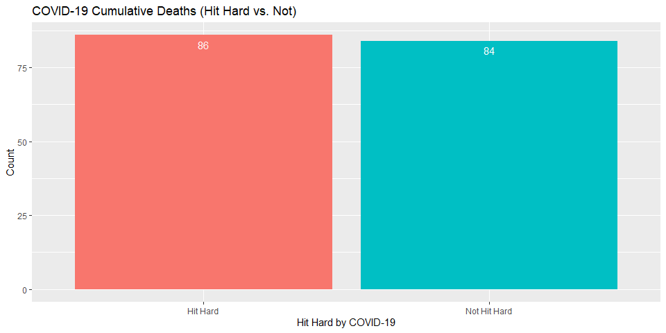

Assessing the Relationship Between Life Expectancies of Countries and
Being Hit Hard by COVID-19
================
Reina Li

-   [Assignment Details](#assignment-details)
-   [Introduction](#introduction)
-   [Analysis Question](#analysis-question)
-   [Description of the Data](#description-of-the-data)
-   [Data Preparation](#data-preparation)
-   [Analysis](#analysis)
-   [Conclusion](#conclusion)

------------------------------------------------------------------------

## Assignment Details

Attempt a preliminary answer to the following question using between one
and five charts: Over the course of the pandemic, were countries with
lower life expectancies hit harder by COVID-19 than countries with
higher life expectancies? Submit your answer in an annotated RMarkdown
file with code and explanation for each chart created and the summary of
the findings of your study. All in the same file. Do not use the
rstudioapi library, as it will not work with RMarkdown. To create the
charts use the provided datasets from: World Bank for life expectancy,
Johns Hopkins for COVID-19, UN for country population and country code
data. You may add further datasets if necessary, but the number of
charts are limited. Only provide charts that help to answer the question
directly.

------------------------------------------------------------------------

## Introduction

According to the [World Health
Organization](https://www.who.int/health-topics/coronavirus#tab=tab_1),
COVID-19 is an infectious disease caused by the SARS-CoV-2 virus. Most
people infected with the virus will experience mild to moderate
respiratory illness and recover without requiring special treatment.
However, some will become seriously ill and require medical attention.
Older people and those with underlying medical conditions like
cardiovascular disease, diabetes, chronic respiratory disease, or cancer
are more likely to develop serious illness. Anyone can get sick with
COVID-19 and become seriously ill or die at any age.

Life expectancy is a measure of premature death and refers to the number
of years a person can expect to live. According to [The World
Bank](https://data.worldbank.org/indicator/SP.DYN.LE00.IN), the global
life expectancy in 2019 was 72.747 years.

The purpose of this analysis is to see if there is a relationship
between life expectancy of a country and the amount of COVID-19 deaths.

------------------------------------------------------------------------

## Analysis Question

**1. Over the course of the pandemic, were countries with lower life
expectancies hit harder by COVID-19 than countries with higher life
expectancies?**

------------------------------------------------------------------------

## Description of the Data

I will use the provided data sets from: [The World
Bank](https://data.worldbank.org/indicator/SP.DYN.LE00.IN) for life
expectancy, [John Hopkins](https://coronavirus.jhu.edu/) for COVID-19,
[UN](https://population.un.org/wup/Download/) for country population and
country code, and
[opendatasoft](https://public.opendatasoft.com/explore/dataset/countries-codes/table/)
for country code to create one to five data visualizations to answer the
analysis question.

Before I start writing any code, I need to define some things:

-   What is considered being “hit hard” by COVID-19?
-   What is considered “low” life expectancy and “high” life expectancy?

[John Hopkins](https://coronavirus.jhu.edu/) provides data on COVID-19
confirmed cases and deaths. But for this analysis, I will be only
looking at the COVID-19 deaths. So, I will evaluate how much a country
was “hit hard by COVID-19” by comparing the amount of COVID-19 deaths of
each country to the global median COVID-19 deaths. The reason why I am
performing the comparison using the median instead the mean is because
the there may be outliers that can skew the data. If a country’s
COVID-19 deaths count is less than the median value of COVID-19 deaths,
then it will be considered as “not hit as hard.” If a country’s COVID-19
deaths count is greater than or equal to the median value of COVID-19
deaths, then it will be considered as “hit hard.”

For the life expectancy data set, I will be looking at a country’s 2019
life expectancy at birth, in years. To determine if a country has “high”
or “low” life expectancy, I will compare it with the global life
expectancy from 2019, which is 72.747 years. If a country’s life
expectancy is less than the global value, then it will be considered as
“low life expectancy.” If a country’s life expectancy is greater than or
equal to the global value, then it will be considered as “high life
expectancy.”

------------------------------------------------------------------------

## Data Preparation

Before I can make data visualizations, the data sets have to be
imported, cleaned, and transformed. So first, I need to load the
libraries.

``` r
# Libraries --------------------------------------------------------------------
library(tidyverse)
library(janitor)
library(lubridate)
library(readxl)
```

Next, I need to import the data sets into the environment. *Please note
that I put all of the data set files in the same folder.*

For the Life Expectancy and Population/Country Code data sets, I need to
edit the data sets before importing it; I removed the first few rows of
the data set, so the new data set would start from the header row.

``` r
# Import the data --------------------------------------------------------------
# World Bank for life expectancy
lifeExpectancy <- read.csv(file = 'API_SP.DYN.LE00.IN_DS2_en_csv_v2_3852476.csv', 
                           fileEncoding="UTF-8-BOM")

# John Hopkins for COVID-19
covidGlobalData <- read.csv(file = 'time_series_covid19_deaths_global.csv')
covidUSData <- read.csv(file = 'time_series_covid19_deaths_US.csv')

# UN for country population and country code
population_countryCode <- read_excel("WUP2018-F05-Total_Population.xls")

# opendatasoft for country code
countrycodes <- read_excel('countries-codes.xlsx')
```

The data sets are now imported into the environment. After checking out
the structures of the data sets, not all of the data will be used. That
is why it is important to tidy, manipulate, and join the data sets.

``` r
# Tidy the data ----------------------------------------------------------------
lifeExpectancy_Data <- lifeExpectancy %>%
  # Keep the country name, country code, and the 2019 life expectancy
  select(Country.Name, Country.Code, X2019) %>%
  # Make a new column that states if the country has high or low life expectancy
  # high life expectancy: value >= 72.747
  # low life expectancy: value < 72.747
  mutate(Life_Expectancy = ifelse(test = (X2019 >= 72.747),
                           yes = "High Life Expectancy",
                           no = "Low Life Expectancy")) %>%
  # Rename life expectancy column
  rename(life_expectancy_years = X2019)

covidGlobal_Deaths <- covidGlobalData %>%
  # Keep the country name and the cumulative amount of COVID-19 deaths
  select(Country.Region, X4.3.22) %>%
  # Rename country name column
  rename(country_name = Country.Region) %>%
  # Group by country
  group_by(country_name) %>%
  # Find the total cumulative amount of COVID-19 deaths for countries
  summarize(X4.3.22 = sum(X4.3.22)) %>%
  # Rename COVID-19 deaths column
  rename(cumulative_deaths = X4.3.22)

covidUS_Deaths <- covidUSData %>%
  # Keep the country name and the cumulative amount of COVID-19 deaths
  select(Country_Region, X4.3.22) %>%
  # Rename country name column
  rename(country_name = Country_Region) %>%
  # Group by country
  group_by(country_name) %>%
  # Find the total cumulative amount of COVID-19 deaths for countries
  summarize(X4.3.22 = sum(X4.3.22)) %>%
  # Rename COVID-19 deaths column
  rename(cumulative_deaths = X4.3.22) %>%
  # Rename US to United States
  mutate(country_name = ifelse(country_name == "US", 
                               "United States of America", 
                               country_name))

# Combine Global and US COVID-19 Deaths data
covid_Deaths <- rbind(covidGlobal_Deaths, covidUS_Deaths) %>%
  # Make a new column that states if the country was hit hard by COVID-19
  # Calculate the median count of COVID-19 deaths
  # median(covid_Deaths$cumulative_deaths)
  # The median is 3136 deaths.
  # hit hard: value >= 3136
  # not hit as hard: value < 3136
  mutate(Hit_Hard_By_COVID19 = ifelse(test = (cumulative_deaths >= 3136),
                           yes = "Hit Hard",
                           no = "Not Hit Hard"))

population_countryCode_Data <- population_countryCode %>%
  # Keep the country name, country code, and the 2020 population
  select(Country, Country_code, X2020) %>%
  # Rename the population column
  rename(population2020 = X2020)

# Join the data frames
population_and_country_codes <- countrycodes %>%
  # The country code column needs to be converted from character into integer
  mutate_at(4, as.numeric) %>%
  # Inner join on the country code
  inner_join(population_countryCode_Data, by = c("ONU" = "Country_code"))

df <- population_and_country_codes %>%
  # Keep the country code, country name and 2020 population
  select(ISO3, ONU, Country, population2020) %>%
  # Inner join on the country code
  inner_join(lifeExpectancy_Data, by = c("ISO3" = "Country.Code")) %>%
  inner_join(covid_Deaths, by = c("Country" = "country_name")) %>%
  # Keep the country code, country name, 2020 population, 2019 life expectancy, 
  # indication of low/high life expectancy, cumulative COVID-19 deaths, and 
  # indication of being hit hard or not by COVID-19
  select(ISO3, ONU, Country, population2020, life_expectancy_years, 
         Life_Expectancy, cumulative_deaths, Hit_Hard_By_COVID19)
```

------------------------------------------------------------------------

## Analysis

Now that the data set is all tidied up, it is time to create the data
visualizations that will help answer the analysis question directly.

``` r
# Create data visualizations ---------------------------------------------------
h_line <- 72.747

ggplot(data = subset(df, !is.na(life_expectancy_years)), 
       aes(x = Country, y = life_expectancy_years)) + 
  geom_point(aes(colour = Life_Expectancy)) + 
  geom_hline(aes(yintercept = h_line)) + 
  geom_text(aes(0, h_line, label = "Average Life Expectancy: 72.747 years", 
                vjust = -1, hjust = -0.1)) + 
  labs(title = "2019 Life Expectancy",
       x = "Country",
       y = "Life Expectancy (years)") + 
  theme(legend.position = "bottom",
        axis.text.x = element_text(angle = 90, hjust = 1, vjust = 0.5, colour = 'gray50'))
```

<!-- -->

``` r
# Create data visualizations ---------------------------------------------------
ggplot(data = subset(df, !is.na(life_expectancy_years)), 
       aes(x = factor(Life_Expectancy))) + 
  geom_bar(stat="count", aes(fill = Life_Expectancy)) + 
  geom_text(stat = "count", aes(label = after_stat(count)), vjust = 1.6,
            color = "white") +
  labs(title = "2019 Life Expectancy Count (High vs. Low)",
       x = "Life Expectancy",
       y = "Count") + 
  theme(legend.position = "none")
```

<!-- -->

``` r
# Create data visualizations ---------------------------------------------------
h_line <- 3136

ggplot(data = subset(df, !is.na(cumulative_deaths)), 
       aes(x = Country, y = cumulative_deaths)) + 
  geom_point(aes(colour = Hit_Hard_By_COVID19)) + 
  geom_hline(aes(yintercept = h_line)) +
  geom_text(aes(0, h_line, label = "Median COVID-19 Cumulative Deaths: 3136 people", 
                vjust = -1, hjust = -0.1)) + 
  labs(title = "COVID-19 Cumulative Deaths (updated 2022.04.03)",
       x = "Country",
       y = "Cumulative deaths (person)") + 
  theme(legend.position = "bottom",
        axis.text.x = element_text(angle = 90, hjust = 1, vjust = 0.5, colour = 'gray50'))
```

<!-- -->

``` r
# Create data visualizations ---------------------------------------------------
ggplot(data = subset(df, !is.na(cumulative_deaths)), 
       aes(x = factor(Hit_Hard_By_COVID19))) + 
  geom_bar(stat="count", aes(fill = Hit_Hard_By_COVID19)) + 
  geom_text(stat = "count", aes(label = after_stat(count)), vjust = 1.6,
            color = "white") +
  labs(title = "COVID-19 Cumulative Deaths (Hit Hard vs. Not)",
       x = "Hit Hard by COVID-19",
       y = "Count") + 
  theme(legend.position = "none")
```

<!-- -->

``` r
# Create data visualizations ---------------------------------------------------
ggplot(data = subset(df, !is.na(life_expectancy_years)), 
       mapping = aes(x = Hit_Hard_By_COVID19, fill = Hit_Hard_By_COVID19)) + 
  geom_histogram(position = "identity", stat="count") + 
    geom_text(stat = "count", aes(label = after_stat(count)), vjust = 1.6,
            color = "white") +
  facet_grid(.~Life_Expectancy) + 
  labs(title = "Countries Life Expectancy and Being Hit Hard by COVID-19",
       x = "Being Hit Hard by COVID-19",
       y = "Count") + 
    theme(legend.position = "bottom")
```

<!-- -->

------------------------------------------------------------------------

## Conclusion

Looking at the data visualizations, it seems like over the course of the
pandemic, countries with lower life expectancies were **not** hit harder
by COVID-19 than countries with higher life expectancies.
