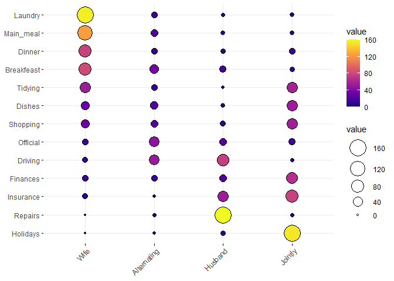

HW2
================
Reina Li
9/9/2021

# Visualizing Multivariate Categorical Data Using Balloon Plot

In a balloon plot, the area of the dots is proportional to their
numerical value.

<http://www.sthda.com/english/articles/32-r-graphics-essentials/129-visualizing-multivariate-categorical-data/>

``` r
# load packages
library(ggplot2)
library(ggpubr)
```

``` r
#load demo data set "Housetasks"
housetasks <- read.delim(
  system.file("demo-data/housetasks.txt",package="ggpubr"),
  row.names=1
)
```

``` r
#print data set
housetasks
```

    ##            Wife Alternating Husband Jointly
    ## Laundry     156          14       2       4
    ## Main_meal   124          20       5       4
    ## Dinner       77          11       7      13
    ## Breakfeast   82          36      15       7
    ## Tidying      53          11       1      57
    ## Dishes       32          24       4      53
    ## Shopping     33          23       9      55
    ## Official     12          46      23      15
    ## Driving      10          51      75       3
    ## Finances     13          13      21      66
    ## Insurance     8           1      53      77
    ## Repairs       0           3     160       2
    ## Holidays      0           1       6     153

``` r
#create balloon plot
ggballoonplot(housetasks,fill="value")+scale_fill_viridis_c(option="C")
```

<!-- -->

Housetasks such as dinner, breakfast, and laundry are done more often by
the wife.

Driving and repairs are done more often by the husband.

Finances, insurance, and holidays are done often jointly.
