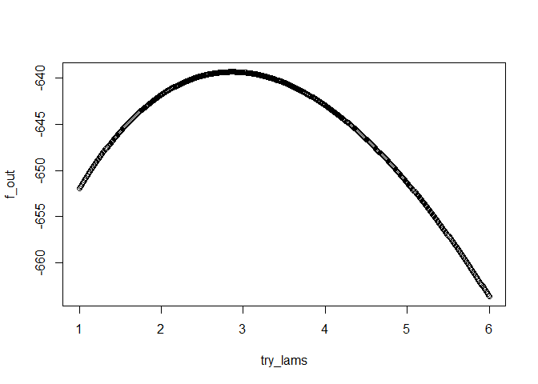

HW3
================
Reina Li
9/23/2021

``` r
# load libraries
library(here)
library(tidyverse)
library(dedupewider)
```

# 4.10 Suppose y is  (,), where , {\Sigma} = \left(\begin{array}{rrr}6 & 1 & -2 \\1 & 13 & 4 \\-2 & 4 & 4\end{array}\right)")

``` r
# declare variables mu and sigma
y_mu <- matrix(data = c(3,1,4), ncol = 1)
y_Sigma <- matrix(data = c(6,1,-2,1,13,4,-2,4,4), ncol=3, byrow = TRUE)

# print them
y_mu
```

    ##      [,1]
    ## [1,]    3
    ## [2,]    1
    ## [3,]    4

``` r
y_Sigma
```

    ##      [,1] [,2] [,3]
    ## [1,]    6    1   -2
    ## [2,]    1   13    4
    ## [3,]   -2    4    4

------------------------------------------------------------------------

## a) Find the distribution of z = 2 -  + 3.

``` r
# declare variable a
a <- matrix(data = c(2,-1,3), ncol = 1)

# print it
a
```

    ##      [,1]
    ## [1,]    2
    ## [2,]   -1
    ## [3,]    3

")

``` r
# find a'$\mu$ and assign it to variable transpose_a_mu
transpose_a_mu <- t(a) %*% y_mu

# find a'$\Sigma$a and assign it to variable transpose_a_sigma_a
transpose_a_sigma_a <- t(a) %*% y_Sigma %*% a

# print them
transpose_a_mu
```

    ##      [,1]
    ## [1,]   17

``` r
transpose_a_sigma_a
```

    ##      [,1]
    ## [1,]   21

The distribution of z =
2-+3
is
(17,21).

------------------------------------------------------------------------

## b) Find the joint distribution of  =  +  +  and  =  -  + .

``` r
# declare variable A
A <- matrix(data = c(1,1,1,1,-1,2), ncol = 3, byrow = TRUE)

# print it
A
```

    ##      [,1] [,2] [,3]
    ## [1,]    1    1    1
    ## [2,]    1   -1    2

")

``` r
# find A$\mu$ and assign it to variable A_mu
A_mu <- A %*% y_mu

# find A$\Sigma$A' and assign it to variable A_sigma_transpose_A
A_sigma_transpose_A <- A %*% y_Sigma %*% t(A)

# print them
A_mu
```

    ##      [,1]
    ## [1,]    8
    ## [2,]   10

``` r
A_sigma_transpose_A
```

    ##      [,1] [,2]
    ## [1,]   29   -1
    ## [2,]   -1    9

The joint distribution of

=

+

+

and

=

-

+

is

\[, \left(\begin{array}{rrr}29 & -1 \\-1 & 9\end{array}\right)")\].

------------------------------------------------------------------------

## c) Find the distribution of .

If y is

(,),
then the distribution of

is N
(,)
= N (1,13).

------------------------------------------------------------------------

## d) Find the joint distribution of  and .

 = \left(\begin{array}{rrr}3 \\4\end{array}\right)
")

 = \left(\begin{array}{rrr}6 & -2 \\-2 & 4\end{array}\right)
")

The joint distribution of

and

is

\[, \left(\begin{array}{rrr}6 & -2 \\-2 & 4\end{array}\right)")\].

------------------------------------------------------------------------

## e) Find the joint distribution of , , and ( + ).

``` r
# declare variable A
A <- matrix(data = c(1,0,0,0,0,1,0.5,0.5,0), ncol = 3, byrow = TRUE)

# print it
A
```

    ##      [,1] [,2] [,3]
    ## [1,]  1.0  0.0    0
    ## [2,]  0.0  0.0    1
    ## [3,]  0.5  0.5    0

``` r
# find A$\mu$ and assign it to variable A_mu
A_mu <- A %*% y_mu

# find A$\Sigma$A' and assign it to variable A_sigma_transpose_A
A_sigma_transpose_A <- A %*% y_Sigma %*% t(A)

# print them
A_mu
```

    ##      [,1]
    ## [1,]    3
    ## [2,]    4
    ## [3,]    2

``` r
A_sigma_transpose_A
```

    ##      [,1] [,2] [,3]
    ## [1,]  6.0   -2 3.50
    ## [2,] -2.0    4 1.00
    ## [3,]  3.5    1 5.25

The joint distribution of
,
,
and
(
+
)
is

\[, \left(\begin{array}{rrr}6 & -2 & 3.5 \\-2 & 4 & 1 \\3.5 & 1 & 5.25\end{array}\right)")\].

------------------------------------------------------------------------

# 4.19 For the ramus bone data treated in Example 4.6.2, check each of the four variables for univariate normality using the following techniques:

## a) Q-Q plots

``` r
table_3_7 <- readr::read_delim(here("ma_book_data","T3_7_BONE.DAT"), delim = " ", col_names = c("ObsNum", "y1", "y2", "y3", "y4"), show_col_types = F)
mat_3_7 <- na_move(table_3_7)
mat_3_7 <- mat_3_7 %>%
  select(ObsNum, y1, y2, y3, y4)
mat_3_7$ObsNum <- as.numeric(mat_3_7$ObsNum)
mat_3_7$y1 <- as.numeric(mat_3_7$y1)
mat_3_7$y2 <- as.numeric(mat_3_7$y2)
mat_3_7$y3 <- as.numeric(mat_3_7$y3)
mat_3_7$y4 <- as.numeric(mat_3_7$y4)
mat_3_7_a <- as.matrix(mat_3_7)
```

``` r
par(mfrow = c(2,2))
# Q-Q plot for first variable
with(mat_3_7, {
  qqnorm(y1, main = "var1");
  qqline(y1)})

# Q-Q plot for second variable
with(mat_3_7, {
  qqnorm(y2, main = "var2");
  qqline(y2)})

# Q-Q plot for third variable
with(mat_3_7, {
  qqnorm(y3, main = "var3");
  qqline(y3)})

# Q-Q plot for fourth variable
with(mat_3_7, {
  qqnorm(y4, main = "var4");
  qqline(y4)})
```

<!-- -->

For each Q-Q plot of the four variables, the points fall along a
straight line, so the data seems to be normally distributed.

------------------------------------------------------------------------

## b)  and  as given by (4.18) and (4.19)

``` r
# save the each column values into variables
y1_val <- mat_3_7_a[,2]
y2_val <- mat_3_7_a[,3]
y3_val <- mat_3_7_a[,4]
y4_val <- mat_3_7_a[,5]

# set up matrix with all the calculated values of sqrt(b1) and b2 for each of the four variables
part_b <- data.frame(matrix(ncol = 4, nrow = 2))
part_b_col <- c("y1", "y2", "y3", "y4")
part_b_row <- c("sqrt(b1)", "b2")
colnames(part_b) <- part_b_col
rownames(part_b) <- part_b_row
```

``` r
# calculate srqt(b1) for each variable
part_b[1,1] <- (sqrt(20) * sum((y1_val - mean(y1_val))^3)) / (sum((y1_val - mean(y1_val))^2))^(3/2)
part_b[1,2] <- (sqrt(20) * sum((y2_val - mean(y2_val))^3)) / (sum((y2_val - mean(y2_val))^2))^(3/2)
part_b[1,3] <- (sqrt(20) * sum((y3_val - mean(y3_val))^3)) / (sum((y3_val - mean(y3_val))^2))^(3/2)
part_b[1,4] <- (sqrt(20) * sum((y4_val - mean(y4_val))^3)) / (sum((y4_val - mean(y4_val))^2))^(3/2)

# calculate b2 for each variable
part_b[2,1] <- (20 * sum((y1_val - mean(y1_val))^4)) / (sum((y1_val - mean(y1_val))^2))^2
part_b[2,2] <- (20 * sum((y2_val - mean(y2_val))^4)) / (sum((y2_val - mean(y2_val))^2))^2
part_b[2,3] <- (20 * sum((y3_val - mean(y3_val))^4)) / (sum((y3_val - mean(y3_val))^2))^2
part_b[2,4] <- (20 * sum((y4_val - mean(y4_val))^4)) / (sum((y4_val - mean(y4_val))^2))^2

# print the matrix
part_b
```

    ##                 y1        y2         y3         y4
    ## sqrt(b1) 0.3069452 0.3111074 0.06448814 0.06370236
    ## b2       1.9317682 2.1067097 1.79235572 1.56974040

For each of the four variables, the calculated

value is greater than 0, so the skewness is positive. For each of the
four variables, the calculated

value is less than 3, so there is negative kurtosis.

*Reject the hypothesis of normality if

is greater than the table value or less than the negative of the table
value.*

Using Table A.1, the 2.5 upper percentile of

for n=20 is 0.942. None of the

values for the four variables is neither greater than 0.942, nor less
than -0.942.

*Reject the hypothesis of normality if b2 is greater than an upper
percentile or less than a lower percentile.*

Using Table A.3, the 2.5 percentile of

for n=20 is 1.74. And the 97.5 percentile of

for n=20 is is 4.68. None of the

values for the four variables is greater than 4.68. We reject the
hypothesis of normality for variable y4 since it is less than the lower
percentile (1.56974040 \< 1.74).

------------------------------------------------------------------------

## c) D’Agostino’s test using D and Y given in (4.22) and (4.23)

``` r
# set up matrix with all the calculated values of D and Y for each of the four variables
part_c <- data.frame(matrix(ncol = 4, nrow = 2))
part_c_col <- c("y1", "y2", "y3", "y4")
part_c_row <- c("D", "Y")
colnames(part_c) <- part_c_col
rownames(part_c) <- part_c_row
```

``` r
# sort the values in each column for the variables
sorted_y1 <- sort(y1_val)
sorted_y2 <- sort(y2_val)
sorted_y3 <- sort(y3_val)
sorted_y4 <- sort(y4_val)
```

``` r
# initialize numerator_part_c
numerator_part_c_val <- 0

# calculate D for each variable

# var1
for (i in 1:20)
{
  numerator_part_c_val[i] <- (i - 0.5*(20+1)) * sorted_y1[i]
}

numerator_part_c_total <- numerator_part_c_val[1] + numerator_part_c_val[2] + numerator_part_c_val[3] + numerator_part_c_val[4] + numerator_part_c_val[5] + numerator_part_c_val[6] + numerator_part_c_val[7] + numerator_part_c_val[8] + numerator_part_c_val[9] + numerator_part_c_val[10] + numerator_part_c_val[11] + numerator_part_c_val[12] + numerator_part_c_val[13] + numerator_part_c_val[14] + numerator_part_c_val[15] + numerator_part_c_val[16] + numerator_part_c_val[17] + numerator_part_c_val[18] + numerator_part_c_val[19] + numerator_part_c_val[20]

part_c[1,1] <- numerator_part_c_total / (sqrt(20^3 * sum((y1_val - mean(y1_val))^2)))

# var2
for (i in 1:20)
{
  numerator_part_c_val[i] <- (i - 0.5*(20+1)) * sorted_y2[i]
}

numerator_part_c_total <- numerator_part_c_val[1] + numerator_part_c_val[2] + numerator_part_c_val[3] + numerator_part_c_val[4] + numerator_part_c_val[5] + numerator_part_c_val[6] + numerator_part_c_val[7] + numerator_part_c_val[8] + numerator_part_c_val[9] + numerator_part_c_val[10] + numerator_part_c_val[11] + numerator_part_c_val[12] + numerator_part_c_val[13] + numerator_part_c_val[14] + numerator_part_c_val[15] + numerator_part_c_val[16] + numerator_part_c_val[17] + numerator_part_c_val[18] + numerator_part_c_val[19] + numerator_part_c_val[20]

part_c[1,2] <- numerator_part_c_total / (sqrt(20^3 * sum((y2_val - mean(y2_val))^2)))

# var3
for (i in 1:20)
{
  numerator_part_c_val[i] <- (i - 0.5*(20+1)) * sorted_y3[i]
}

numerator_part_c_total <- numerator_part_c_val[1] + numerator_part_c_val[2] + numerator_part_c_val[3] + numerator_part_c_val[4] + numerator_part_c_val[5] + numerator_part_c_val[6] + numerator_part_c_val[7] + numerator_part_c_val[8] + numerator_part_c_val[9] + numerator_part_c_val[10] + numerator_part_c_val[11] + numerator_part_c_val[12] + numerator_part_c_val[13] + numerator_part_c_val[14] + numerator_part_c_val[15] + numerator_part_c_val[16] + numerator_part_c_val[17] + numerator_part_c_val[18] + numerator_part_c_val[19] + numerator_part_c_val[20]

part_c[1,3] <- numerator_part_c_total / (sqrt(20^3 * sum((y3_val - mean(y3_val))^2)))

# var4
for (i in 1:20)
{
  numerator_part_c_val[i] <- (i - 0.5*(20+1)) * sorted_y4[i]
}

numerator_part_c_total <- numerator_part_c_val[1] + numerator_part_c_val[2] + numerator_part_c_val[3] + numerator_part_c_val[4] + numerator_part_c_val[5] + numerator_part_c_val[6] + numerator_part_c_val[7] + numerator_part_c_val[8] + numerator_part_c_val[9] + numerator_part_c_val[10] + numerator_part_c_val[11] + numerator_part_c_val[12] + numerator_part_c_val[13] + numerator_part_c_val[14] + numerator_part_c_val[15] + numerator_part_c_val[16] + numerator_part_c_val[17] + numerator_part_c_val[18] + numerator_part_c_val[19] + numerator_part_c_val[20]

part_c[1,4] <- numerator_part_c_total / (sqrt(20^3 * sum((y4_val - mean(y4_val))^2)))
```

``` r
# calculate Y for each variable
part_c[2,1] <- (sqrt(20) * (part_c[1,1] - (2*sqrt(pi))^(-1))) / 0.02998598
part_c[2,2] <- (sqrt(20) * (part_c[1,2] - (2*sqrt(pi))^(-1))) / 0.02998598
part_c[2,3] <- (sqrt(20) * (part_c[1,3] - (2*sqrt(pi))^(-1))) / 0.02998598
part_c[2,4] <- (sqrt(20) * (part_c[1,4] - (2*sqrt(pi))^(-1))) / 0.02998598

# print the matrix
part_c
```

    ##          y1        y2        y3        y4
    ## D 0.2847908 0.2840619 0.2866075 0.2851061
    ## Y 0.4020825 0.2933804 0.6730256 0.4491165

*Reject the hypothesis of normality if Y is greater than an upper
percentile or less than a lower percentile.*

Using Table A.4, the 2.5 percentile of Y for n=20 is -3.04. And the 97.5
percentile of Y for n=20 is is 0.628. None of the Y values for the four
variables is less than -3.04. We reject the hypothesis of normality for
variable y3 since it is greater than the upper percentile (0.6730256 \>
0.628).

------------------------------------------------------------------------

## d) The test by Lin and Mudholkar using z defined in (4.24)

``` r
# set up matrix with all the calculated values of z for each of the four variables
z <- data.frame(matrix(ncol = 4, nrow = 1))
z_col <- c("y1", "y2", "y3", "y4")
z_row <- c("z")
colnames(z) <- z_col
rownames(z) <- z_row
```

``` r
# set up matrix with all the calculated values of r for each of the four variables
r_val <- data.frame(matrix(ncol = 4, nrow = 1))
r_val_col <- c("y1", "y2", "y3", "y4")
r_val_row <- c("r")
colnames(r_val) <- r_val_col
rownames(r_val) <- r_val_row
```

``` r
# calculate xi for var1
x1_i <- 0
x1_i[1] <- (1/20)*(sum((y1_val[setdiff(1:20,seq(1))])^2)-((sum(y1_val[setdiff(1:20,seq(1))]))^2 / (20-1)))^(1/3)
x1_i[2] <- (1/20)*(sum((y1_val[setdiff(1:20,seq(2))])^2)-((sum(y1_val[setdiff(1:20,seq(2))]))^2 / (20-1)))^(1/3)
x1_i[3] <- (1/20)*(sum((y1_val[setdiff(1:20,seq(3))])^2)-((sum(y1_val[setdiff(1:20,seq(3))]))^2 / (20-1)))^(1/3)
x1_i[4] <- (1/20)*(sum((y1_val[setdiff(1:20,seq(4))])^2)-((sum(y1_val[setdiff(1:20,seq(4))]))^2 / (20-1)))^(1/3)
x1_i[5] <- (1/20)*(sum((y1_val[setdiff(1:20,seq(5))])^2)-((sum(y1_val[setdiff(1:20,seq(5))]))^2 / (20-1)))^(1/3)
x1_i[6] <- (1/20)*(sum((y1_val[setdiff(1:20,seq(6))])^2)-((sum(y1_val[setdiff(1:20,seq(6))]))^2 / (20-1)))^(1/3)
x1_i[7] <- (1/20)*(sum((y1_val[setdiff(1:20,seq(7))])^2)-((sum(y1_val[setdiff(1:20,seq(7))]))^2 / (20-1)))^(1/3)
x1_i[8] <- (1/20)*(sum((y1_val[setdiff(1:20,seq(8))])^2)-((sum(y1_val[setdiff(1:20,seq(8))]))^2 / (20-1)))^(1/3)
x1_i[9] <- (1/20)*(sum((y1_val[setdiff(1:20,seq(9))])^2)-((sum(y1_val[setdiff(1:20,seq(9))]))^2 / (20-1)))^(1/3)
x1_i[10] <- (1/20)*(sum((y1_val[setdiff(1:20,seq(10))])^2)-((sum(y1_val[setdiff(1:20,seq(10))]))^2 / (20-1)))^(1/3)
x1_i[11] <- (1/20)*(sum((y1_val[setdiff(1:20,seq(11))])^2)-((sum(y1_val[setdiff(1:20,seq(11))]))^2 / (20-1)))^(1/3)
x1_i[12] <- (1/20)*(sum((y1_val[setdiff(1:20,seq(12))])^2)-((sum(y1_val[setdiff(1:20,seq(12))]))^2 / (20-1)))^(1/3)
x1_i[13] <- (1/20)*(sum((y1_val[setdiff(1:20,seq(13))])^2)-((sum(y1_val[setdiff(1:20,seq(13))]))^2 / (20-1)))^(1/3)
x1_i[14] <- (1/20)*(sum((y1_val[setdiff(1:20,seq(14))])^2)-((sum(y1_val[setdiff(1:20,seq(14))]))^2 / (20-1)))^(1/3)
x1_i[15] <- (1/20)*(sum((y1_val[setdiff(1:20,seq(15))])^2)-((sum(y1_val[setdiff(1:20,seq(15))]))^2 / (20-1)))^(1/3)
x1_i[16] <- (1/20)*(sum((y1_val[setdiff(1:20,seq(16))])^2)-((sum(y1_val[setdiff(1:20,seq(16))]))^2 / (20-1)))^(1/3)
x1_i[17] <- (1/20)*(sum((y1_val[setdiff(1:20,seq(17))])^2)-((sum(y1_val[setdiff(1:20,seq(17))]))^2 / (20-1)))^(1/3)
x1_i[18] <- (1/20)*(sum((y1_val[setdiff(1:20,seq(18))])^2)-((sum(y1_val[setdiff(1:20,seq(18))]))^2 / (20-1)))^(1/3)
x1_i[19] <- (1/20)*(sum((y1_val[setdiff(1:20,seq(19))])^2)-((sum(y1_val[setdiff(1:20,seq(19))]))^2 / (20-1)))^(1/3)
x1_i[20] <- (1/20)*(sum((y1_val[setdiff(1:20,seq(20))])^2)-((sum(y1_val[setdiff(1:20,seq(20))]))^2 / (20-1)))^(1/3)
# calculate r for var1
r_val[1,1] <- cor(y1_val,x1_i)
```

``` r
# calculate xi for var2
x2_i <- 0
x2_i[1] <- (1/20)*(sum((y2_val[setdiff(1:20,seq(1))])^2)-((sum(y2_val[setdiff(1:20,seq(1))]))^2 / (20-1)))^(1/3)
x2_i[2] <- (1/20)*(sum((y2_val[setdiff(1:20,seq(2))])^2)-((sum(y2_val[setdiff(1:20,seq(2))]))^2 / (20-1)))^(1/3)
x2_i[3] <- (1/20)*(sum((y2_val[setdiff(1:20,seq(3))])^2)-((sum(y2_val[setdiff(1:20,seq(3))]))^2 / (20-1)))^(1/3)
x2_i[4] <- (1/20)*(sum((y2_val[setdiff(1:20,seq(4))])^2)-((sum(y2_val[setdiff(1:20,seq(4))]))^2 / (20-1)))^(1/3)
x2_i[5] <- (1/20)*(sum((y2_val[setdiff(1:20,seq(5))])^2)-((sum(y2_val[setdiff(1:20,seq(5))]))^2 / (20-1)))^(1/3)
x2_i[6] <- (1/20)*(sum((y2_val[setdiff(1:20,seq(6))])^2)-((sum(y2_val[setdiff(1:20,seq(6))]))^2 / (20-1)))^(1/3)
x2_i[7] <- (1/20)*(sum((y2_val[setdiff(1:20,seq(7))])^2)-((sum(y2_val[setdiff(1:20,seq(7))]))^2 / (20-1)))^(1/3)
x2_i[8] <- (1/20)*(sum((y2_val[setdiff(1:20,seq(8))])^2)-((sum(y2_val[setdiff(1:20,seq(8))]))^2 / (20-1)))^(1/3)
x2_i[9] <- (1/20)*(sum((y2_val[setdiff(1:20,seq(9))])^2)-((sum(y2_val[setdiff(1:20,seq(9))]))^2 / (20-1)))^(1/3)
x2_i[10] <- (1/20)*(sum((y2_val[setdiff(1:20,seq(10))])^2)-((sum(y2_val[setdiff(1:20,seq(10))]))^2 / (20-1)))^(1/3)
x2_i[11] <- (1/20)*(sum((y2_val[setdiff(1:20,seq(11))])^2)-((sum(y2_val[setdiff(1:20,seq(11))]))^2 / (20-1)))^(1/3)
x2_i[12] <- (1/20)*(sum((y2_val[setdiff(1:20,seq(12))])^2)-((sum(y2_val[setdiff(1:20,seq(12))]))^2 / (20-1)))^(1/3)
x2_i[13] <- (1/20)*(sum((y2_val[setdiff(1:20,seq(13))])^2)-((sum(y2_val[setdiff(1:20,seq(13))]))^2 / (20-1)))^(1/3)
x2_i[14] <- (1/20)*(sum((y2_val[setdiff(1:20,seq(14))])^2)-((sum(y2_val[setdiff(1:20,seq(14))]))^2 / (20-1)))^(1/3)
x2_i[15] <- (1/20)*(sum((y2_val[setdiff(1:20,seq(15))])^2)-((sum(y2_val[setdiff(1:20,seq(15))]))^2 / (20-1)))^(1/3)
x2_i[16] <- (1/20)*(sum((y2_val[setdiff(1:20,seq(16))])^2)-((sum(y2_val[setdiff(1:20,seq(16))]))^2 / (20-1)))^(1/3)
x2_i[17] <- (1/20)*(sum((y2_val[setdiff(1:20,seq(17))])^2)-((sum(y2_val[setdiff(1:20,seq(17))]))^2 / (20-1)))^(1/3)
x2_i[18] <- (1/20)*(sum((y2_val[setdiff(1:20,seq(18))])^2)-((sum(y2_val[setdiff(1:20,seq(18))]))^2 / (20-1)))^(1/3)
x2_i[19] <- (1/20)*(sum((y2_val[setdiff(1:20,seq(19))])^2)-((sum(y2_val[setdiff(1:20,seq(19))]))^2 / (20-1)))^(1/3)
x2_i[20] <- (1/20)*(sum((y2_val[setdiff(1:20,seq(20))])^2)-((sum(y2_val[setdiff(1:20,seq(20))]))^2 / (20-1)))^(1/3)
# calculate r for var2
r_val[1,2] <- cor(y2_val,x2_i)
```

``` r
# calculate xi for var3
x3_i <- 0
x3_i[1] <- (1/20)*(sum((y3_val[setdiff(1:20,seq(1))])^2)-((sum(y3_val[setdiff(1:20,seq(1))]))^2 / (20-1)))^(1/3)
x3_i[2] <- (1/20)*(sum((y3_val[setdiff(1:20,seq(2))])^2)-((sum(y3_val[setdiff(1:20,seq(2))]))^2 / (20-1)))^(1/3)
x3_i[3] <- (1/20)*(sum((y3_val[setdiff(1:20,seq(3))])^2)-((sum(y3_val[setdiff(1:20,seq(3))]))^2 / (20-1)))^(1/3)
x3_i[4] <- (1/20)*(sum((y3_val[setdiff(1:20,seq(4))])^2)-((sum(y3_val[setdiff(1:20,seq(4))]))^2 / (20-1)))^(1/3)
x3_i[5] <- (1/20)*(sum((y3_val[setdiff(1:20,seq(5))])^2)-((sum(y3_val[setdiff(1:20,seq(5))]))^2 / (20-1)))^(1/3)
x3_i[6] <- (1/20)*(sum((y3_val[setdiff(1:20,seq(6))])^2)-((sum(y3_val[setdiff(1:20,seq(6))]))^2 / (20-1)))^(1/3)
x3_i[7] <- (1/20)*(sum((y3_val[setdiff(1:20,seq(7))])^2)-((sum(y3_val[setdiff(1:20,seq(7))]))^2 / (20-1)))^(1/3)
x3_i[8] <- (1/20)*(sum((y3_val[setdiff(1:20,seq(8))])^2)-((sum(y3_val[setdiff(1:20,seq(8))]))^2 / (20-1)))^(1/3)
x3_i[9] <- (1/20)*(sum((y3_val[setdiff(1:20,seq(9))])^2)-((sum(y3_val[setdiff(1:20,seq(9))]))^2 / (20-1)))^(1/3)
x3_i[10] <- (1/20)*(sum((y3_val[setdiff(1:20,seq(10))])^2)-((sum(y3_val[setdiff(1:20,seq(10))]))^2 / (20-1)))^(1/3)
x3_i[11] <- (1/20)*(sum((y3_val[setdiff(1:20,seq(11))])^2)-((sum(y3_val[setdiff(1:20,seq(11))]))^2 / (20-1)))^(1/3)
x3_i[12] <- (1/20)*(sum((y3_val[setdiff(1:20,seq(12))])^2)-((sum(y3_val[setdiff(1:20,seq(12))]))^2 / (20-1)))^(1/3)
x3_i[13] <- (1/20)*(sum((y3_val[setdiff(1:20,seq(13))])^2)-((sum(y3_val[setdiff(1:20,seq(13))]))^2 / (20-1)))^(1/3)
x3_i[14] <- (1/20)*(sum((y3_val[setdiff(1:20,seq(14))])^2)-((sum(y3_val[setdiff(1:20,seq(14))]))^2 / (20-1)))^(1/3)
x3_i[15] <- (1/20)*(sum((y3_val[setdiff(1:20,seq(15))])^2)-((sum(y3_val[setdiff(1:20,seq(15))]))^2 / (20-1)))^(1/3)
x3_i[16] <- (1/20)*(sum((y3_val[setdiff(1:20,seq(16))])^2)-((sum(y3_val[setdiff(1:20,seq(16))]))^2 / (20-1)))^(1/3)
x3_i[17] <- (1/20)*(sum((y3_val[setdiff(1:20,seq(17))])^2)-((sum(y3_val[setdiff(1:20,seq(17))]))^2 / (20-1)))^(1/3)
x3_i[18] <- (1/20)*(sum((y3_val[setdiff(1:20,seq(18))])^2)-((sum(y3_val[setdiff(1:20,seq(18))]))^2 / (20-1)))^(1/3)
x3_i[19] <- (1/20)*(sum((y3_val[setdiff(1:20,seq(19))])^2)-((sum(y3_val[setdiff(1:20,seq(19))]))^2 / (20-1)))^(1/3)
x3_i[20] <- (1/20)*(sum((y3_val[setdiff(1:20,seq(20))])^2)-((sum(y3_val[setdiff(1:20,seq(20))]))^2 / (20-1)))^(1/3)
# calculate r for var3
r_val[1,3] <- cor(y3_val,x3_i)
```

``` r
# calculate xi for var4
x4_i <- 0
x4_i[1] <- (1/20)*(sum((y4_val[setdiff(1:20,seq(1))])^2)-((sum(y4_val[setdiff(1:20,seq(1))]))^2 / (20-1)))^(1/3)
x4_i[2] <- (1/20)*(sum((y4_val[setdiff(1:20,seq(2))])^2)-((sum(y4_val[setdiff(1:20,seq(2))]))^2 / (20-1)))^(1/3)
x4_i[3] <- (1/20)*(sum((y4_val[setdiff(1:20,seq(3))])^2)-((sum(y4_val[setdiff(1:20,seq(3))]))^2 / (20-1)))^(1/3)
x4_i[4] <- (1/20)*(sum((y4_val[setdiff(1:20,seq(4))])^2)-((sum(y4_val[setdiff(1:20,seq(4))]))^2 / (20-1)))^(1/3)
x4_i[5] <- (1/20)*(sum((y4_val[setdiff(1:20,seq(5))])^2)-((sum(y4_val[setdiff(1:20,seq(5))]))^2 / (20-1)))^(1/3)
x4_i[6] <- (1/20)*(sum((y4_val[setdiff(1:20,seq(6))])^2)-((sum(y4_val[setdiff(1:20,seq(6))]))^2 / (20-1)))^(1/3)
x4_i[7] <- (1/20)*(sum((y4_val[setdiff(1:20,seq(7))])^2)-((sum(y4_val[setdiff(1:20,seq(7))]))^2 / (20-1)))^(1/3)
x4_i[8] <- (1/20)*(sum((y4_val[setdiff(1:20,seq(8))])^2)-((sum(y4_val[setdiff(1:20,seq(8))]))^2 / (20-1)))^(1/3)
x4_i[9] <- (1/20)*(sum((y4_val[setdiff(1:20,seq(9))])^2)-((sum(y4_val[setdiff(1:20,seq(9))]))^2 / (20-1)))^(1/3)
x4_i[10] <- (1/20)*(sum((y4_val[setdiff(1:20,seq(10))])^2)-((sum(y4_val[setdiff(1:20,seq(10))]))^2 / (20-1)))^(1/3)
x4_i[11] <- (1/20)*(sum((y4_val[setdiff(1:20,seq(11))])^2)-((sum(y4_val[setdiff(1:20,seq(11))]))^2 / (20-1)))^(1/3)
x4_i[12] <- (1/20)*(sum((y4_val[setdiff(1:20,seq(12))])^2)-((sum(y4_val[setdiff(1:20,seq(12))]))^2 / (20-1)))^(1/3)
x4_i[13] <- (1/20)*(sum((y4_val[setdiff(1:20,seq(13))])^2)-((sum(y4_val[setdiff(1:20,seq(13))]))^2 / (20-1)))^(1/3)
x4_i[14] <- (1/20)*(sum((y4_val[setdiff(1:20,seq(14))])^2)-((sum(y4_val[setdiff(1:20,seq(14))]))^2 / (20-1)))^(1/3)
x4_i[15] <- (1/20)*(sum((y4_val[setdiff(1:20,seq(15))])^2)-((sum(y4_val[setdiff(1:20,seq(15))]))^2 / (20-1)))^(1/3)
x4_i[16] <- (1/20)*(sum((y4_val[setdiff(1:20,seq(16))])^2)-((sum(y4_val[setdiff(1:20,seq(16))]))^2 / (20-1)))^(1/3)
x4_i[17] <- (1/20)*(sum((y4_val[setdiff(1:20,seq(17))])^2)-((sum(y3_val[setdiff(1:20,seq(17))]))^2 / (20-1)))^(1/3)
x4_i[18] <- (1/20)*(sum((y4_val[setdiff(1:20,seq(18))])^2)-((sum(y4_val[setdiff(1:20,seq(18))]))^2 / (20-1)))^(1/3)
x4_i[19] <- (1/20)*(sum((y4_val[setdiff(1:20,seq(19))])^2)-((sum(y4_val[setdiff(1:20,seq(19))]))^2 / (20-1)))^(1/3)
x4_i[20] <- (1/20)*(sum((y4_val[setdiff(1:20,seq(20))])^2)-((sum(y4_val[setdiff(1:20,seq(20))]))^2 / (20-1)))^(1/3)
# calculate r for var4
r_val[1,4] <- cor(y4_val,x4_i)
```

``` r
z_val <- data.frame(matrix(ncol = 4, nrow = 1))
z_val[1,1] <- atanh(r_val[1,1])
z_val[1,2] <- atanh(r_val[1,2])
z_val[1,3] <- atanh(r_val[1,3])
z_val[1,4] <- atanh(r_val[1,4])
z_val
```

    ##          X1        X2        X3        X4
    ## 1 0.3557248 0.3383102 0.2100628 0.2862048

------------------------------------------------------------------------

# 4.26 Use the Baker corn field data in Table 3.3.

## a) Use the methods in Section 4.5.1 to find the optimal univariate transformation to normality for the B, Ca, and Cu measurements.

``` r
table_3_3 <- readr::read_delim(here('ma_book_data','T3_3_BAKER.DAT'), delim = "  ", col_names = c("x", "y", "corn97bu", "b", "ca", "cu", "fe", "k", "mg", "mn", "na", "p", "zn"))
mat_3_3 <- as.matrix(table_3_3)
```

``` r
library(dplyr)
library(ggplot2)
library(MASS)
```

``` r
df_3_3 <- as.data.frame(table_3_3)

# b
summary(model_b <- lm(b ~ corn97bu, data=df_3_3))
```

    ## 
    ## Call:
    ## lm(formula = b ~ corn97bu, data = df_3_3)
    ## 
    ## Residuals:
    ##     Min      1Q  Median      3Q     Max 
    ## -3.2675 -1.6676 -0.5822  1.3050  6.4967 
    ## 
    ## Coefficients:
    ##             Estimate Std. Error t value Pr(>|t|)   
    ## (Intercept) 3.461185   1.094144   3.163  0.00179 **
    ## corn97bu    0.009176   0.007100   1.292  0.19761   
    ## ---
    ## Signif. codes:  0 '***' 0.001 '**' 0.01 '*' 0.05 '.' 0.1 ' ' 1
    ## 
    ## Residual standard error: 2.159 on 213 degrees of freedom
    ## Multiple R-squared:  0.007781,   Adjusted R-squared:  0.003123 
    ## F-statistic:  1.67 on 1 and 213 DF,  p-value: 0.1976

``` r
par(mfrow=c(2,2))
plot(model_b)
```

``` r
bc_b <- boxcox(model_b)
str(bc_b)
```

    ## List of 2
    ##  $ x: num [1:100] -2 -1.96 -1.92 -1.88 -1.84 ...
    ##  $ y: num [1:100] -474 -471 -468 -465 -462 ...

``` r
(bc_b.power <- bc_b$x[which.max(bc_b$y)])
```

    ## [1] -0.1010101

``` r
# ca
summary(model_ca <- lm(ca ~ corn97bu, data=df_3_3))
```

    ## 
    ## Call:
    ## lm(formula = ca ~ corn97bu, data = df_3_3)
    ## 
    ## Residuals:
    ##     Min      1Q  Median      3Q     Max 
    ## -4526.4 -1834.2  -864.2   476.7 29129.5 
    ## 
    ## Coefficients:
    ##             Estimate Std. Error t value Pr(>|t|)    
    ## (Intercept) -5851.19    1996.61  -2.931  0.00375 ** 
    ## corn97bu       65.87      12.96   5.084 8.06e-07 ***
    ## ---
    ## Signif. codes:  0 '***' 0.001 '**' 0.01 '*' 0.05 '.' 0.1 ' ' 1
    ## 
    ## Residual standard error: 3941 on 213 degrees of freedom
    ## Multiple R-squared:  0.1082, Adjusted R-squared:  0.104 
    ## F-statistic: 25.85 on 1 and 213 DF,  p-value: 8.062e-07

``` r
par(mfrow=c(2,2))
```

``` r
plot(model_ca)
```

``` r
bc_ca <- boxcox(model_ca)
str(bc_ca)
```

    ## List of 2
    ##  $ x: num [1:100] -2 -1.96 -1.92 -1.88 -1.84 ...
    ##  $ y: num [1:100] -554 -549 -545 -540 -536 ...

``` r
(bc_ca.power <- bc_ca$x[which.max(bc_ca$y)])
```

    ## [1] -0.4242424

``` r
# cu
summary(model_cu <- lm(cu ~ corn97bu, data=df_3_3))
```

    ## 
    ## Call:
    ## lm(formula = cu ~ corn97bu, data = df_3_3)
    ## 
    ## Residuals:
    ##      Min       1Q   Median       3Q      Max 
    ## -1.73425 -0.60718 -0.04863  0.51920  2.29001 
    ## 
    ## Coefficients:
    ##              Estimate Std. Error t value Pr(>|t|)    
    ## (Intercept) -2.722819   0.406434  -6.699 1.84e-10 ***
    ## corn97bu     0.030462   0.002637  11.551  < 2e-16 ***
    ## ---
    ## Signif. codes:  0 '***' 0.001 '**' 0.01 '*' 0.05 '.' 0.1 ' ' 1
    ## 
    ## Residual standard error: 0.8022 on 213 degrees of freedom
    ## Multiple R-squared:  0.3851, Adjusted R-squared:  0.3822 
    ## F-statistic: 133.4 on 1 and 213 DF,  p-value: < 2.2e-16

``` r
par(mfrow=c(2,2))
```

``` r
plot(model_cu)
```

``` r
bc_cu <- boxcox(model_cu)
str(bc_cu)
```

    ## List of 2
    ##  $ x: num [1:100] -2 -1.96 -1.92 -1.88 -1.84 ...
    ##  $ y: num [1:100] -772 -761 -749 -738 -726 ...

``` r
(bc_cu.power <- bc_cu$x[which.max(bc_cu$y)])
```

    ## [1] 0.3434343

``` r
transform_boxcox <- function(y, lambda=0)
  {
    if (lambda == 0)
    {
      log(y)
      }
    else {
      (y^lambda - 1) / lambda
      }
    }
```

Source:
<http://www.css.cornell.edu/faculty/dgr2/_static/files/R_html/Transformations.html>

``` r
transform_bc_b <- transform_boxcox(df_3_3$b, bc_b.power)
transform_bc_ca <- transform_boxcox(df_3_3$ca, bc_ca.power)
transform_bc_cu <- transform_boxcox(df_3_3$cu, bc_cu.power)
```

``` r
# print the histogram plots
par(mfrow=c(1,3))
B <- df_3_3$b
Ca <- df_3_3$ca
Cu <- df_3_3$cu
hist(B)
hist(Ca)
hist(Cu)
```

<!-- -->

``` r
par(mfrow=c(1,3))
bc_b <- boxcox(model_b)
bc_ca <- boxcox(model_ca)
bc_cu <- boxcox(model_cu)
```

<!-- -->

``` r
# print the transformed plot
par(mfrow=c(1,3))
hist(transform_bc_b)
hist(transform_bc_ca)
hist(transform_bc_cu)
```

<!-- -->

``` r
# print the lambdas
bc_b.power
```

    ## [1] -0.1010101

``` r
bc_ca.power
```

    ## [1] -0.4242424

``` r
bc_cu.power
```

    ## [1] 0.3434343

The optimal univariate transformation to normality for the B measurement
is

= -0.101.

The optimal univariate transformation to normality for the Ca
measurement is

= -0.424.

The optimal univariate transformation to normality for the Cu
measurement is

= 0.343.

------------------------------------------------------------------------

## b) Use the methods in Section 4.5.2 to find the optimal multivariate transformation to 3-variate normality for the B, Ca, and Cu measurements.

``` r
bc_trans <- car::powerTransform(mat_3_3[,4:6, drop = F])
bc_trans
```

    ## Estimated transformation parameters 
    ##          b         ca         cu 
    ## -0.1545215 -0.4834283  0.4968027

``` r
car::bcPower(mat_3_3[,4:6, drop = F], coef(bc_trans)) %>% 
  pairs()
```

<!-- -->

``` r
mat_3_3[,4:6, drop = F] %>% pairs
```

<!-- -->

``` r
l_lambda <- function(lambda, y)
  {
  y_lam <- (y^lambda - 1)/lambda
  n <- length(y)
  s_lam_2 <- 1/n * sum((y_lam - mean(y_lam))^2)
  -n/2 * log(s_lam_2) + (lambda - 1) * sum(log(y))
  }
try_lams <- seq(1,6, by = .01)
f_out <- sapply(try_lams, l_lambda, y = mat_3_3[, 3])
plot(try_lams, f_out)
```

<!-- -->

``` r
try_lams[which.max(f_out)]
```

    ## [1] 2.87

``` r
bc_trans
```

    ## Estimated transformation parameters 
    ##          b         ca         cu 
    ## -0.1545215 -0.4834283  0.4968027

The optimal multivariate transformation to 3-variate normality for the
B, Ca, and Cu measurements is
 = \left(\begin{array}{rrr}-0.154 \\-0.483 \\0.497\end{array}\right)")

------------------------------------------------------------------------

## c) How do the transformations obtained from the two approaches compare?

The multivariate transformation
(
= (-0.154, -0.483, 0.497)) is similar to the transformation obtained by
applying the optimal transformation
(
values of -0.101, -0.424, 0.343) to each of the three variables: B, Ca,
and Cu, respectively.
