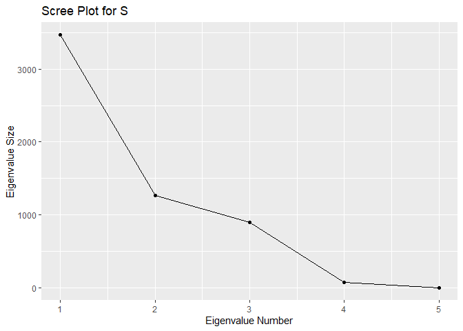
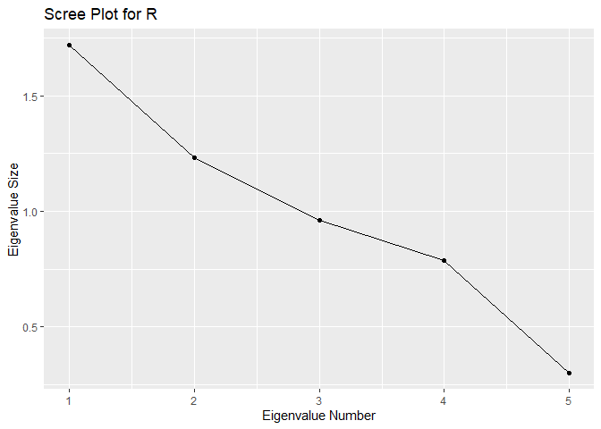

HW5
================
Reina Li
10/14/2021

# 12.6 Carry out a principal component analysis of the diabetes data of Table 3.5. Use all five variables, including y’s and x’s. Use both S and R. Which do you think is more appropriate here? Show the percent of variance explained. Based on the average eigenvalue or a scree plot, decide how many components to retain. Can you interpret the components of either S or R?

## Carry out a principal component analysis of the diabetes data of Table 3.5. Use all five variables, including y’s and x’s.

``` r
# load libraries
library(here)
library(ggplot2)
library(dplyr)
```

``` r
# load table
table3_5 <- readr::read_fwf(here('ma_book_data', 'T3_5_DIABETES.DAT'))
```

    ## Rows: 46 Columns: 6
    ## -- Column specification --------------------------------------------------------
    ## 
    ## dbl (6): X1, X2, X3, X4, X5, X6
    ## 
    ## i Use `spec()` to retrieve the full column specification for this data.
    ## i Specify the column types or set `show_col_types = FALSE` to quiet this message.

``` r
colnames(table3_5) <- c("", "y1", "y2", "x1", "x2", "x3")
```

Column names were found on textbook pages 73-74 and at
<https://cran.r-project.org/web/packages/candisc/vignettes/diabetes.html>


= relative weight


= fasting plasma glucose


= glucose intolerance


= insulin response to oral glucose


= insulin resistance

``` r
sub_tab_3_5 <- table3_5[,2:6]
```

``` r
# Calculating S

ybar <- colMeans(sub_tab_3_5)

# compute the covariance matrix
S <- cov(sub_tab_3_5)

# calculate eigenvectors and eigenvalues
eigen_vals <- eigen(S)
```

``` r
# Calculating R

# center and scale the data
tab_3_5 <- scale(sub_tab_3_5, center = TRUE, scale = TRUE)

# compute the correlation matrix
R <- cor(tab_3_5)

# calculate eigenvectors and eigenvalues
eigens <- eigen(R)
```

### The covariance matrix, S, is as follows:

``` r
S
```

    ##             y1         y2           x1           x2          x3
    ## y1  0.01618184   0.216029    0.7871691   -0.2138454    2.189072
    ## y2  0.21602899  70.558937   26.2289855  -23.9560386  -20.841546
    ## x1  0.78716908  26.228986 1106.4135266  396.7323671  108.383575
    ## x2 -0.21384541 -23.956039  396.7323671 2381.8826087 1142.637681
    ## x3  2.18907246 -20.841546  108.3835749 1142.6376812 2136.396135

### The variances of the variables, y1, y2, x1, x2, x3 (the diagonal of S, which is the covariance matrix) are as follows:

``` r
diag(S)
```

    ##           y1           y2           x1           x2           x3 
    ## 1.618184e-02 7.055894e+01 1.106414e+03 2.381883e+03 2.136396e+03

### The total variance is:

``` r
sum(diag(S))
```

    ## [1] 5695.267

### The eigenvalues of S are as follows:

``` r
# makes a table of the eigenvalue, proportion of variance, and cumulative proportion
tibble(eigen_vals = eigen_vals$values) %>%
  mutate(prop_var = eigen_vals/sum(eigen_vals)) %>%
  mutate(cum_prob = cumsum(prop_var))
```

    ## # A tibble: 5 x 3
    ##   eigen_vals   prop_var cum_prob
    ##        <dbl>      <dbl>    <dbl>
    ## 1  3466.     0.609         0.609
    ## 2  1264.     0.222         0.831
    ## 3   895.     0.157         0.988
    ## 4    69.3    0.0122        1.00 
    ## 5     0.0114 0.00000201    1

### The corresponding eigenvectors are as follows:

``` r
eigen_vals$vectors
```

    ##               [,1]          [,2]         [,3]         [,4]          [,5]
    ## [1,] -0.0004000338  0.0007797631 -0.001790748 -0.002853710  0.9999939407
    ## [2,]  0.0080430117 -0.0166018253 -0.028590488 -0.999416799 -0.0028870982
    ## [3,] -0.1547283109 -0.6382201919 -0.753510273  0.030914777 -0.0008253663
    ## [4,] -0.7429697521 -0.4279397984  0.514468587 -0.013590620  0.0009189842
    ## [5,] -0.6511453350  0.6397392336 -0.408318158 -0.004182095 -0.0015024637

### The principal components of S are:


### The eigenvalues of R are as follows:

``` r
# makes a table of the eigenvalue, proportion of variance, and cumulative proportion
tibble(eigen_vals = eigens$values) %>%
  mutate(prop_var = eigen_vals/sum(eigen_vals)) %>%
  mutate(cum_prob = cumsum(prop_var))
```

    ## # A tibble: 5 x 3
    ##   eigen_vals prop_var cum_prob
    ##        <dbl>    <dbl>    <dbl>
    ## 1      1.72    0.343     0.343
    ## 2      1.23    0.247     0.590
    ## 3      0.960   0.192     0.782
    ## 4      0.787   0.157     0.940
    ## 5      0.302   0.0604    1

### The corresponding eigenvectors are as follows:

``` r
eigens$vectors
```

    ##             [,1]       [,2]       [,3]       [,4]       [,5]
    ## [1,] -0.41553044 -0.5295048  0.4181274 -0.3993240  0.4611605
    ## [2,] -0.07352227 -0.6840790 -0.1558701  0.7012017 -0.1032041
    ## [3,] -0.36395661 -0.1974475 -0.7620396 -0.4356454 -0.2409541
    ## [4,] -0.54219580  0.4258696 -0.2490388  0.3857172  0.5602327
    ## [5,] -0.62887855  0.1769468  0.3976800  0.1014490 -0.6362078

### The principal components of R are:


## Use both S and R. Which do you think is more appropriate here?

I think that R is more appropriate here because the variances differ
widely (components of S is dominated by the variables with large
variances).

## Show the percent of variance explained.

``` r
# this is for S
tibble(eigen_vals = eigen_vals$values) %>%
  mutate(prop_var = eigen_vals/sum(eigen_vals)) %>%
  mutate(cum_prob = cumsum(prop_var))
```

    ## # A tibble: 5 x 3
    ##   eigen_vals   prop_var cum_prob
    ##        <dbl>      <dbl>    <dbl>
    ## 1  3466.     0.609         0.609
    ## 2  1264.     0.222         0.831
    ## 3   895.     0.157         0.988
    ## 4    69.3    0.0122        1.00 
    ## 5     0.0114 0.00000201    1

One component of S accounts for 61% of the total variance. Two
components of S account for 83% of the total variance. Three components
of S account for 99% of the total variance.

``` r
# this is for R
tibble(eigen_vals = eigens$values) %>%
  mutate(prop_var = eigen_vals/sum(eigen_vals)) %>%
  mutate(cum_prob = cumsum(prop_var))
```

    ## # A tibble: 5 x 3
    ##   eigen_vals prop_var cum_prob
    ##        <dbl>    <dbl>    <dbl>
    ## 1      1.72    0.343     0.343
    ## 2      1.23    0.247     0.590
    ## 3      0.960   0.192     0.782
    ## 4      0.787   0.157     0.940
    ## 5      0.302   0.0604    1

One component of R accounts for 34% of the total variance. Two
components of R account for 59% of the total variance. Three components
of R account for 78% of the total variance. Four components of R account
for 94% of the total variance.

## Based on the average eigenvalue or a scree plot, decide how many components to retain.

``` r
# for S
# decide how many components to retain based on the average eigenvalue
count <- 0
for (i in 1:5) {
  if (eigen_vals$values[i] > mean(eigen_vals$values)) {
    print(paste(eigen_vals$values[i],"> average eigenvalue, will be retained."))
    count <- count +1
  }
}
```

    ## [1] "3466.18182227296 > average eigenvalue, will be retained."
    ## [1] "1264.47054292344 > average eigenvalue, will be retained."

``` r
print(paste("The total amount of components for S to retain is", count))
```

    ## [1] "The total amount of components for S to retain is 2"

``` r
# for R
# decide how many components to retain based on the average eigenvalue
count <- 0
for (i in 1:5) {
  if (eigens$values[i] > mean(eigens$values)) {
    print(paste(eigens$values[i],"> average eigenvalue, will be retained."))
    count <- count +1
  }
}
```

    ## [1] "1.7172402803206 > average eigenvalue, will be retained."
    ## [1] "1.23384886518108 > average eigenvalue, will be retained."

``` r
print(paste("The total amount of components for R to retain is", count))
```

    ## [1] "The total amount of components for R to retain is 2"

``` r
# create a scree plot for S
qplot(c(1:5), eigen_vals$values) + 
  geom_line() + 
  xlab("Eigenvalue Number") + 
  ylab("Eigenvalue Size") + 
  ggtitle("Scree Plot for S")
```

<!-- -->

``` r
# create a scree plot for R
qplot(c(1:5), eigens$values) +
  geom_line() + 
  xlab("Eigenvalue Number") + 
  ylab("Eigenvalue Size") + 
  ggtitle("Scree Plot for R")
```

<!-- -->

Based on the average eigenvalue, 2 components should be retained for S,
and 2 components should be retained for R.

Based on the scree plot, 1 component should be retained for S, and it is
inconclusive for R.

## Can you interpret the components of either S or R?

Neither variables in S nor R were uncorrelated (orthogonal). Also,
neither covariances in S nor correlations in R were positive.

For S, variables x2 and x3 have a larger variance than the other
variables y1, y2, and x1. Variables x2 and x3 will dominate the first
component, which will account for most of the variance. In other words,
x2 and x3 contribute a lot to the first component. Also, the variances
of variables y1 and y2 are small compared to that of x1, x2, and x3,
which means that y1 and y2 contribute little to the first three
components. For S, the last eigenvalue is near zero and it signifies the
presence of a collinearity.

As for R, the variances of the variables are equal, so y1, y2, x1, x2,
and x3 all contribute to the components.
