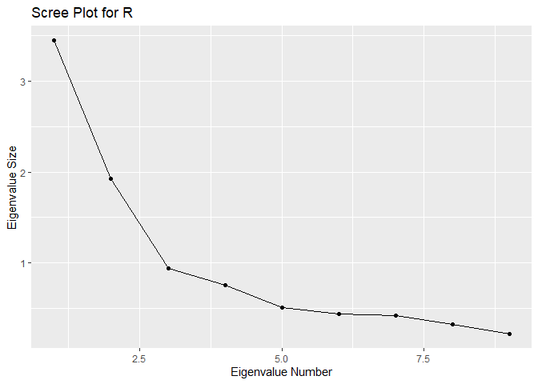

HW6
================
Reina Li
11/11/2021

``` r
# load libraries
library(here)
library(ggplot2)
library(dplyr)
library(matlib)
library(sem)
```

# The matrix below shows the correlations between ratings on nine statements about pain made by 123 people suffering from extreme pain. Each statement was scored on a scale from 1 to 6, ranging from agreement to disagreement. The nine pain statements were as follows:

1.  Whether or not I am in pain in the future depends on the skills of
    the doctors.
2.  Whenever I am in pain, it is usually because of something I have
    done or not done.
3.  Whether or not I am in pain depends on what the doctors do for me.
4.  I cannot get any help for my pain unless I go to seek medical
    advice.
5.  When I am in pain I know that it is because I have not been taking
    proper exercise or eating the right food.
6.  People’s pain results from their own carelessness.
7.  I am directly responsible for my pain.
8.  Relief from pain is chiefly controlled by the doctors.
9.  People who are never in pain are just plain lucky.

``` r
# create the correlation matrix
R <- matrix(data = c(1,-0.04,0.61,0.45,0.03,-0.29,-0.30,0.45,0.30,-0.04,1,-0.07,-0.12,0.49,0.43,0.30,-0.31,-0.17,0.61,-0.07,1,0.59,0.03,-0.13,-0.24,0.59,0.32,0.45,-0.12,0.59,1,-0.08,-0.21,-0.19,0.63,0.37,0.03,0.49,0.03,-0.08,1,0.47,0.41,-0.14,-0.24,-0.29,0.43,-0.13,-0.21,0.47,1,0.63,-0.13,-0.15,-0.30,0.30,-0.24,-0.19,0.41,0.63,1,-0.26,-0.29,0.45,-0.31,0.59,0.63,-0.14,-0.13,-0.26,1,0.40,0.30,-0.17,0.32,0.37,-0.24,-0.15,-0.29,0.40,1), ncol=9, byrow = TRUE)
```

## 5.6

### a) Perform a principal components analysis on these data, and examine the associated scree plot to decide on the appropriate number of components.

``` r
# apply pca to correlation matrix, R
pain_pcacor <- princomp(covmat = R)
vals <- summary(pain_pcacor, loadings = TRUE)
vals
```

    ## Importance of components:
    ##                           Comp.1    Comp.2    Comp.3     Comp.4     Comp.5
    ## Standard deviation     1.8551833 1.3891568 0.9707894 0.86823030 0.71739745
    ## Proportion of Variance 0.3824117 0.2144174 0.1047147 0.08375821 0.05718435
    ## Cumulative Proportion  0.3824117 0.5968291 0.7015437 0.78530194 0.84248629
    ##                            Comp.6     Comp.7     Comp.8     Comp.9
    ## Standard deviation     0.66647108 0.64981811 0.57103782 0.47443855
    ## Proportion of Variance 0.04935374 0.04691818 0.03623158 0.02501022
    ## Cumulative Proportion  0.89184003 0.93875821 0.97498978 1.00000000
    ## 
    ## Loadings:
    ##       Comp.1 Comp.2 Comp.3 Comp.4 Comp.5 Comp.6 Comp.7 Comp.8 Comp.9
    ##  [1,]  0.357  0.268  0.420         0.420  0.457  0.108  0.407  0.246
    ##  [2,] -0.250  0.394  0.399 -0.452 -0.500         0.230  0.184 -0.285
    ##  [3,]  0.374  0.361         0.148                0.400 -0.711 -0.171
    ##  [4,]  0.381  0.280 -0.151  0.132 -0.628  0.144 -0.392         0.409
    ##  [5,] -0.225  0.500  0.254  0.100  0.311 -0.397 -0.600              
    ##  [6,] -0.311  0.408 -0.419 -0.103  0.130 -0.199  0.416         0.561
    ##  [7,] -0.339  0.310 -0.410  0.217         0.647 -0.122        -0.369
    ##  [8,]  0.404  0.220 -0.336  0.216        -0.386  0.121  0.513 -0.448
    ##  [9,]  0.316        -0.333 -0.801  0.242        -0.245 -0.117

``` r
# calculate eigenvectors and eigenvalues
eigens <- eigen(R)

# create a scree plot for R
qplot(c(1:9), eigens$values) +
  geom_line() + 
  xlab("Eigenvalue Number") + 
  ylab("Eigenvalue Size") + 
  ggtitle("Scree Plot for R")
```

<!-- -->

Based on the associated scree plot above, 2 components should be
retained.

### b) Apply maximum likelihood factor analysis, and use the test described in the chapter to select the necessary number of common factors.

``` r
sapply(1:3, function(nf)
  factanal(covmat = R, factors = nf, n.obs = 123)$PVAL)
```

    ##    objective    objective    objective 
    ## 3.582705e-23 3.330276e-06 8.377428e-02

``` r
pain_fa <- factanal(covmat = R, factors = 3, n.obs = 123, rotation = "none")
pain_fa
```

    ## 
    ## Call:
    ## factanal(factors = 3, covmat = R, n.obs = 123, rotation = "none")
    ## 
    ## Uniquenesses:
    ## [1] 0.404 0.518 0.336 0.455 0.499 0.171 0.496 0.239 0.754
    ## 
    ## Loadings:
    ##       Factor1 Factor2 Factor3
    ##  [1,]  0.607   0.297   0.374 
    ##  [2,] -0.458   0.288   0.435 
    ##  [3,]  0.610   0.506   0.189 
    ##  [4,]  0.621   0.400         
    ##  [5,] -0.408   0.441   0.375 
    ##  [6,] -0.677   0.591  -0.145 
    ##  [7,] -0.626   0.331         
    ##  [8,]  0.674   0.481  -0.275 
    ##  [9,]  0.446   0.169  -0.135 
    ## 
    ##                Factor1 Factor2 Factor3
    ## SS loadings      3.004   1.501   0.624
    ## Proportion Var   0.334   0.167   0.069
    ## Cumulative Var   0.334   0.501   0.570
    ## 
    ## Test of the hypothesis that 3 factors are sufficient.
    ## The chi square statistic is 19.2 on 12 degrees of freedom.
    ## The p-value is 0.0838

### c) Rotate the factor solution selected using both an orthogonal and an oblique procedure, and interpret the results.

``` r
# orthogonal procedure
pain_orthogonal <- factanal(covmat = R, factors = 3, n.obs = 123, rotation = "varimax")
pain_orthogonal
```

    ## 
    ## Call:
    ## factanal(factors = 3, covmat = R, n.obs = 123, rotation = "varimax")
    ## 
    ## Uniquenesses:
    ## [1] 0.404 0.518 0.336 0.455 0.499 0.171 0.496 0.239 0.754
    ## 
    ## Loadings:
    ##       Factor1 Factor2 Factor3
    ##  [1,]  0.649  -0.372   0.190 
    ##  [2,] -0.126   0.194   0.655 
    ##  [3,]  0.794  -0.144   0.116 
    ##  [4,]  0.725  -0.106         
    ##  [5,]          0.292   0.645 
    ##  [6,]          0.825   0.377 
    ##  [7,] -0.225   0.590   0.325 
    ##  [8,]  0.815          -0.304 
    ##  [9,]  0.437          -0.221 
    ## 
    ##                Factor1 Factor2 Factor3
    ## SS loadings      2.507   1.331   1.291
    ## Proportion Var   0.279   0.148   0.143
    ## Cumulative Var   0.279   0.426   0.570
    ## 
    ## Test of the hypothesis that 3 factors are sufficient.
    ## The chi square statistic is 19.2 on 12 degrees of freedom.
    ## The p-value is 0.0838

``` r
# oblique procedure
pain_oblique <- factanal(covmat = R, factors = 3, n.obs = 123, rotation = "promax")
pain_oblique
```

    ## 
    ## Call:
    ## factanal(factors = 3, covmat = R, n.obs = 123, rotation = "promax")
    ## 
    ## Uniquenesses:
    ## [1] 0.404 0.518 0.336 0.455 0.499 0.171 0.496 0.239 0.754
    ## 
    ## Loadings:
    ##       Factor1 Factor2 Factor3
    ##  [1,]  0.580  -0.322   0.284 
    ##  [2,]          0.112   0.635 
    ##  [3,]  0.800           0.182 
    ##  [4,]  0.743                 
    ##  [5,]          0.248   0.617 
    ##  [6,]  0.134   0.855   0.260 
    ##  [7,]          0.576   0.233 
    ##  [8,]  0.891   0.251  -0.277 
    ##  [9,]  0.448          -0.192 
    ## 
    ##                Factor1 Factor2 Factor3
    ## SS loadings      2.564   1.305   1.135
    ## Proportion Var   0.285   0.145   0.126
    ## Cumulative Var   0.285   0.430   0.556
    ## 
    ## Factor Correlations:
    ##         Factor1 Factor2 Factor3
    ## Factor1  1.0000   0.415 -0.0992
    ## Factor2  0.4149   1.000 -0.2578
    ## Factor3 -0.0992  -0.258  1.0000
    ## 
    ## Test of the hypothesis that 3 factors are sufficient.
    ## The chi square statistic is 19.2 on 12 degrees of freedom.
    ## The p-value is 0.0838

Looking at the factor correlations from the oblique rotation, it seems
like there is low correlation between each of the factors, which may
indicate that the factors are uncorrelated, so the orthogonal rotation
is more appropriate.

------------------------------------------------------------------------

## 7.1

### Fit a correlated two-factor model in which questions 1, 3, 4, and 8 are assumed to be indicators of the latent variable Doctor’s Responsibility and questions 2, 5, 6, and 7 are assumed to be indicators of the latent variable Patient’s Responsibility. Find a 95% confidence interval for the correlation between the two latent variables.

model:


The model is specified in a text file called “pain_model.txt” with the
following content:

Doc_Responsibility -> Q1, lambda1, NA

Patient_Respons -> Q2, lambda2, NA

Doc_Responsibility -> Q3, lambda3, NA

Doc_Responsibility -> Q4, lambda4, NA

Patient_Respons -> Q5, lambda5, NA

Patient_Respons -> Q6, lambda6, NA

Patient_Respons -> Q7, lambda7, NA

Doc_Responsibility -> Q8, lambda8, NA

Doc_Responsibility \<-> Patient_Respons, rho, NA

Q1 \<-> Q1, theta1, NA

Q2 \<-> Q2, theta2, NA

Q3 \<-> Q3, theta3, NA

Q4 \<-> Q4, theta4, NA

Q5 \<-> Q5, theta5, NA

Q6 \<-> Q6, theta6, NA

Q7 \<-> Q7, theta6, NA

Q8 \<-> Q8, theta6, NA

Doc_Responsibility \<-> Doc_Responsibility, NA, 1

Patient_Respons \<-> Patient_Respons, NA, 1

``` r
pain_model <- specify.model(file = "pain_model.txt")
pain_sem <- sem(pain_model, R, 123)
pain_sem
summary(pain_sem)
```

The estimate is (rho values) 0.4461005 and the standard error is
0.07830070.

``` r
# 95% CI
pain_estimate <- 0.4461005
pain_se <- 0.07830070
lower_bound <- pain_estimate - qnorm(0.05/2, lower.tail = F) * pain_se
lower_bound
```

    ## [1] 0.2926339

``` r
upper_bound <- pain_estimate + qnorm(0.05/2, lower.tail = F) * pain_se
upper_bound
```

    ## [1] 0.5995671

An approximate 95% confidence interval for the correlation between the
two latent variables is \[0.2926339, 0.5995671\].
