Association of Eating Habits and Physical Conditions with Obesity Levels
from Mexico, Peru, and Colombia
================
Reina Li

-   [Introduction](#introduction)
-   [Description of Data](#description-of-data)
-   [Methods and Results](#methods-and-results)
    -   [Data Transformation](#data-transformation)
    -   [Modeling Technique 1](#modeling-technique-1)
        -   [Results](#results)
    -   [Modeling Technique 2](#modeling-technique-2)
        -   [Results](#results-1)
-   [Discussion](#discussion)
-   [Sources](#sources)

------------------------------------------------------------------------

# Introduction

Obesity is a common yet serious disease that affects overall health,
health care costs, and productivity, and can lead to a higher risk of
developing other serious health complications such as type 2 diabetes,
heart disease, and some cancers.

The obesity epidemic is relatively new in South America. According to
the Global Nutrition Report, the average prevalence of obesity in adult
women and men (aged 18 and over) in South America is 29.0% and 21.9%,
respectively. The shifts in less healthy diets, and changes in the food
system (increase in fast food and highly processed foods; and excessive
sugar, sodium, and fat) makes the population more susceptible to
obesity.

This data set obtained from University of California, Irvine, Machine
Learning Repository includes data for the estimation of obesity levels
in individuals from ages 14 to 61 from the countries of Mexico, Peru,
and Colombia, based on their eating habits and physical conditions.

Data was collected through an anonymous survey.

The questions of the survey used for initial recollection of information
are presented below:

1.  What is your gender?

-   Female
-   Male

2.  What is your age?

-   Numeric value

3.  What is your height?

-   Numeric value in meters

4.  What is your weight?

-   Numeric value in kilograms

5.  Has a family member suffered or suffers from overweight?

-   No
-   Yes

6.  Do you eat high caloric food frequently?

-   No
-   Yes

7.  Do you usually eat vegetables in your meals?

-   Always
-   Sometimes
-   Never

8.  How many main meals do you have daily?

-   Between 1 and 2
-   Three
-   More than three

9.  Do you eat any food between meals?

-   No
-   Sometimes
-   Frequently
-   Always

10. Do you smoke?

-   No
-   Yes

11. How much water do you drink daily?

-   Less than a liter
-   Between 1 and 2 L
-   More than 2 L

12. Do you monitor the calories you eat daily?

-   Yes
-   No

13. How often do you have physical activity?

-   I do not have
-   1 or 2 days
-   2 or 4 days
-   4 or 5 days

14. How much time do you use technological devices such as cell phone,
    videogames, television, computer, and others?

-   0-2 hours
-   3-5 hours
-   More than 5 hours

15. How often do you drink alcohol?

-   I do not drink
-   Sometimes
-   Frequently
-   Always

16. Which transportation do you usually use?

-   Bike
-   Walking
-   Public Transportation
-   Automobile
-   Motorbike

The data set contains 17 attributes, relating to eating habits: Frequent
consumption of high caloric food, Frequency of consumption of
vegetables, Number of main meals, Consumption of food between meals,
Consumption of water daily, and Consumption of alcohol; and relating to
physical conditions: Calories consumption monitoring, Physical activity
frequency, Time using technology devices, Transportation used; and other
variables: Gender, Age, Height, and Weight.

After the survey responses were collected and preprocessed, the data was
labeled with the class variable Obesity Level with values of: (1)
Insufficient Weight, (2) Normal Weight, (3) Overweight Level I, (4)
Overweight Level II, (5) Obesity Type I, (6) Obesity Type II, and (7)
Obesity Type III, which is calculated using the body mass index (BMI)
equation,

and information from World Health Organization (WHO) and Mexican
Normativity:

-   Insufficient Weight: Less than 18.5
-   Normal Weight: 18.5 to 24.9
-   Overweight Level I: 25.0 to 27.4
-   Overweight Level II: 27.5 to 29.9
-   Obesity Type I: 30.0 to 34.9
-   Obesity Type II: 35.0 to 39.9
-   Obesity Type III: Higher than 40

After the data was labeled, it was found that there was an unbalanced
distribution of data regarding the obesity levels category. So, 1626
data responses were generated using the tool Weka, and a filter that
required to indicate the class for generation of synthetic data, the
number of nearest neighbors used, the percentage needed to increase the
selected class, and the random seed used for random sampling. This
balancing process brought the total amount of responses from 485 to
2111. The difference of balance of categories of obesity levels before
and after can be seen in the plots below.

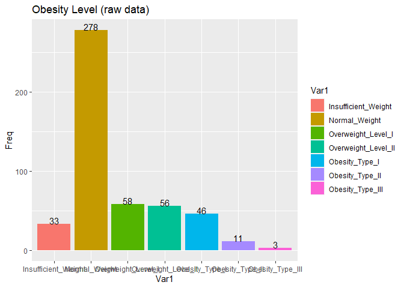<!-- --><!-- -->

Since a large number of people are affected by overweight and obesity
globally, it is important to identify which attributes are associated
the most with obesity. Using this data set with raw and generated data,
the association of the different eating habits and physical conditions
with obesity levels will be determined.

# Description of Data

This data set includes 2111 total instances. 23% (485) of the data
collected is from survey responses, and the remaining 77% (1626) is
generated.

This data set includes 272 instances of one class, 287 instances of
another class, 290 instances of another class, 290 instances of another
class, 351 instances of another class, 297 instances of another class,
and 324 instances of another class. The instances are described by 16
attributes, some of which are either linear, nominal, or ordinal.

There are 16 attributes and the class attribute. The 17 attributes are
named by column, in order in the data set: (1) Gender, (2) Age, (3)
Height, (4) Weight, (5) family_history_with_overweight, (6) FAVC
(frequent consumption of high caloric food), (7) FCVC (frequency of
consumption of vegetables), (8) NCP (number of main meals), (9) CAEC
(consumption of food between meals), (10) SMOKE, (11) CH2O (consumption
of water daily), (12) SCC (calories consumption monitoring), (13) FAF
(physical activity frequency), (14) TUE (time using technology devices),
(15) CALC (consumption of alcohol), (16) MTRANS (transportation used),
and (17) NObeyesdad. NObeyesdad is the class attribute.

The columns were renamed for easier identification, respectively: (1)
Gender, (2) Age, (3) Height, (4) Weight, (5)
Family_History_With_Overweight, (6) High_Caloric_Food, (7) Vegetables,
(8) Daily_Main_Meals, (9) Food_Between_Meals, (10) Smoke, (11) Water,
(12) Monitor_Calories, (13) Physical_Activity, (14)
Technological_Devices, (15) Alcohol, (16) Transportation, and (17)
Obesity_Level.

The following visualizations present the counts or density of the 17
different attributes. Pairs of visualizations are shown for each
attribute to visualize the survey data only (raw data) and the survey
with generated data (raw + generated data).

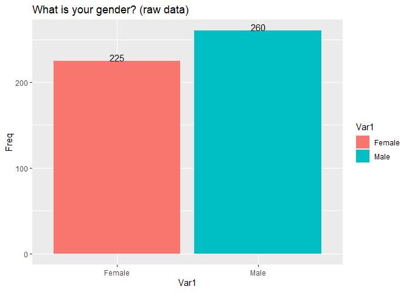<!-- --><!-- -->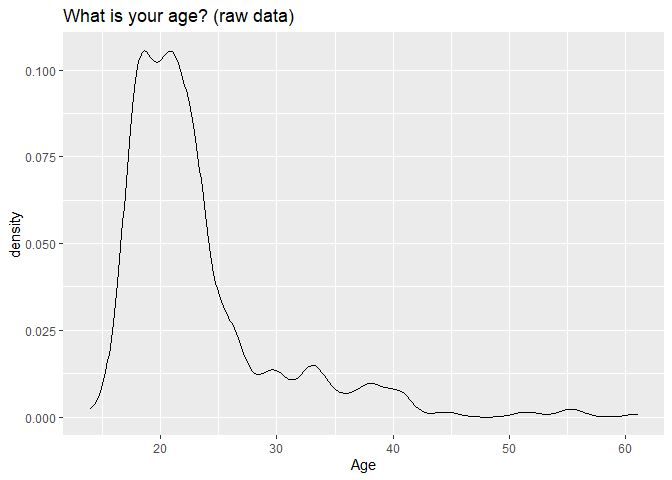<!-- --><!-- --><!-- -->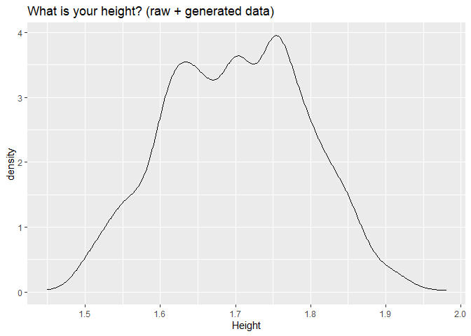<!-- --><!-- -->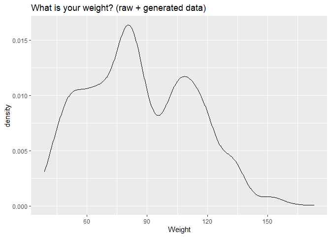<!-- -->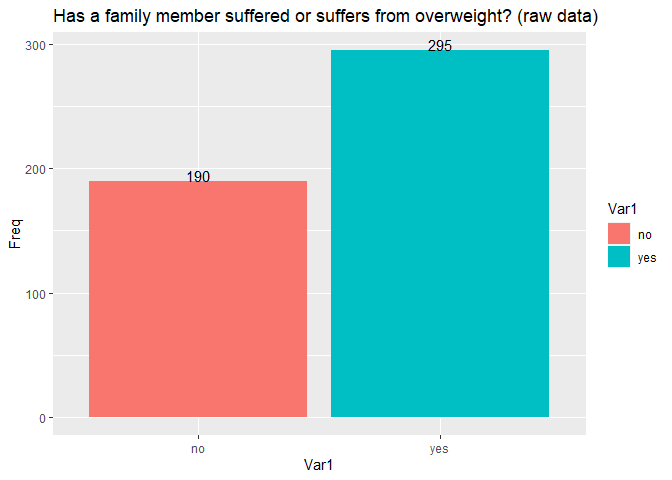<!-- --><!-- -->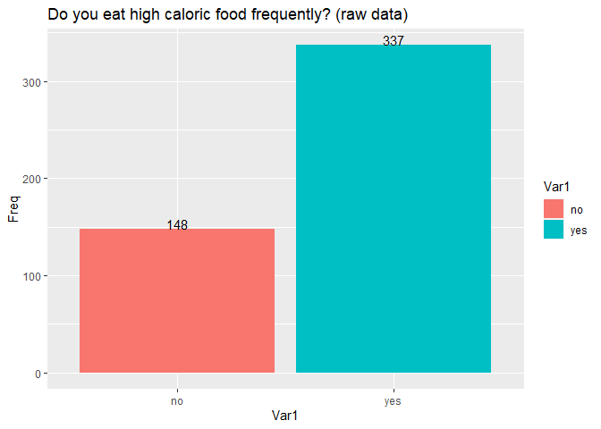<!-- --><!-- -->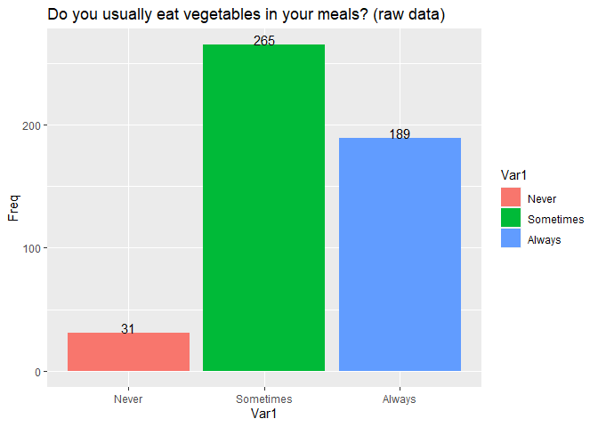<!-- --><!-- --><!-- -->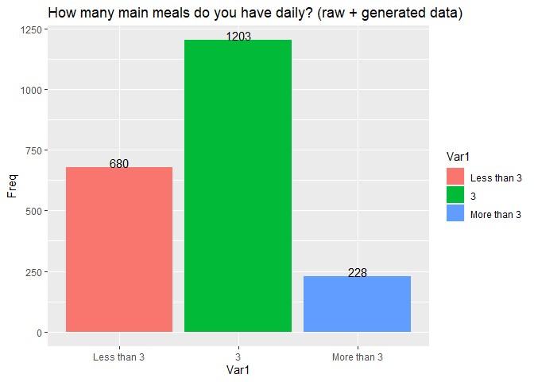<!-- --><!-- --><!-- -->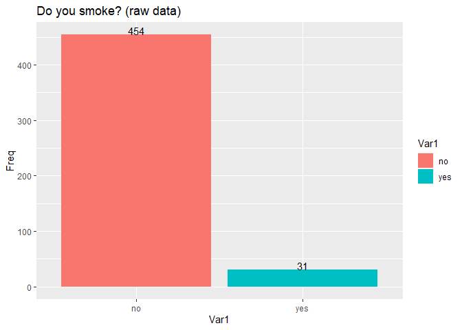<!-- -->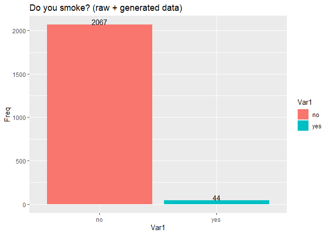<!-- --><!-- --><!-- -->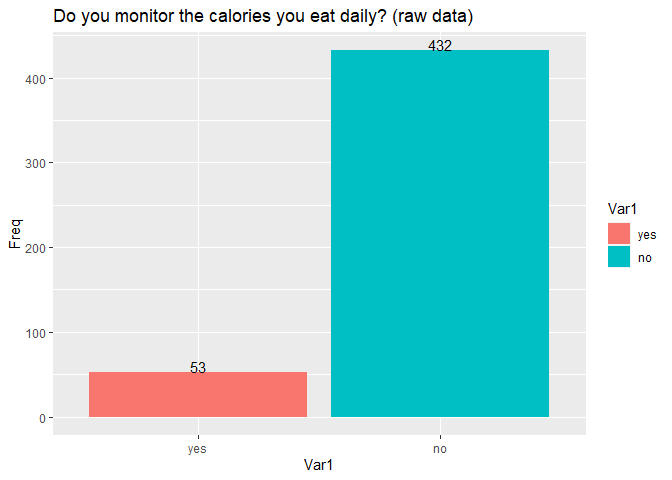<!-- --><!-- --><!-- --><!-- -->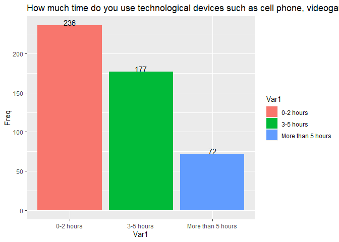<!-- --><!-- -->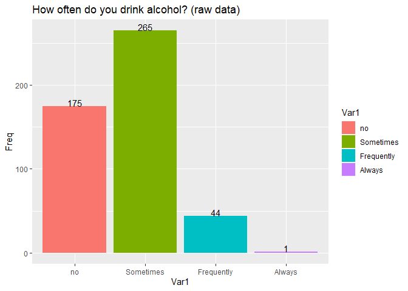<!-- -->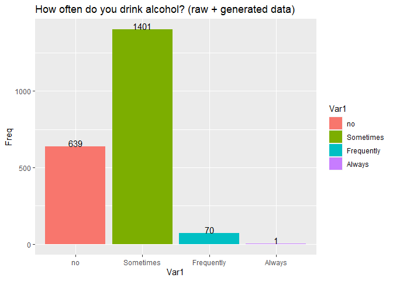<!-- --><!-- -->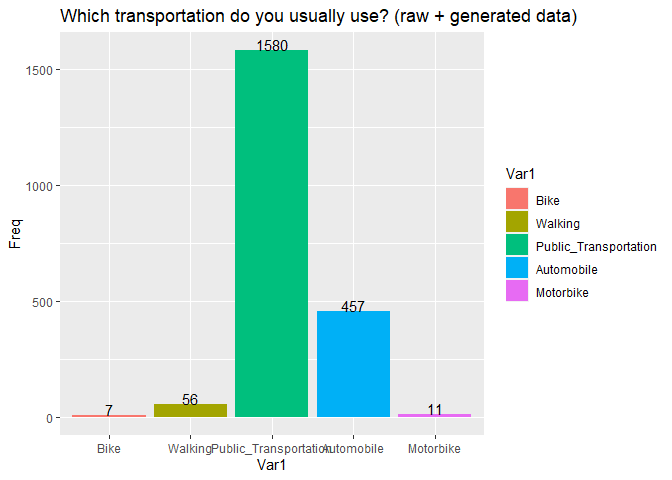<!-- -->

Some of the considerations made include the uncertainty of the values of
Vegetables, Daily_Main_Meals, Water, Physical_Activity, and
Technological_Devices.

In the original data set provided by UCI Machine Learning Repository,
the Vegetables column contained numerical values from 1 to 3 instead of
the provided possible answer: (1) Never, (2) Sometimes, and (3) Always.
For the raw data without generated values, it was decided to assign the
integer value of 1 to the possible answer Never; the value of 2 to
Sometimes; and the value of 3 to Always. However, complications arose
because the generated data included double values, or contained decimal
values.

In the original data set, the Daily_Main_Meals column contained
numerical values from 1 to 4 instead of the provided possible answer:
(1) Less than 3, (2) 3, and (3) More than 3. For the raw data without
generated values, it was decided to consider the values as the number of
daily main meals.

In the original data set, the Water column contained numerical values
from 1 to 3 instead of the provided possible answer: (1) Less than a
liter, (2) Between 1 and 2 L, and (3) More than 2 L. For the raw data
without generated values, it was decided to assign the integer value of
1 to the possible answer Less than a liter; the value of 2 to Between 1
and 2 L; and the value of 3 to More than 2 L. However, complications
arose because the generated data included double values, or contained
decimal values.

In the original data set provided by UCI Machine Learning Repository,
the Physical_Activity column contained numerical values from 0 to 3
instead of the provided possible answer: (1) I do not have, (2) 1 or 2
days, (3) 2 or 4 days, and (4) 4 or 5 days. The cut off was also
unclear. For the raw data without generated values, it was decided to
assign the integer value of 0 to the possible answer I do not have; the
value of 1 to 1 or 2 days; the value of 2 to 2 or 4 days; and the value
of 3 to 4 or 5 days. However, complications arose because the generated
data included double values, or contained decimal values.

In the original data set provided by UCI Machine Learning Repository,
the Technological_Devices column contained numerical values from 0 to 2
instead of the provided possible answer: (1) 0-2 hours, (2) 3-5 hours,
and (3) More than 5 hours. An answer for between 2-3 hours was
unaccounted for. For the raw data without generated values, it was
decided to assign the integer value of 0 to the possible answer 0-2
hours; the value of 1 to 3-5 hours; and the value of 2 to More than 5
hours. However, complications arose because the generated data included
double values, or contained decimal values.

Additional considerations made include the evaluation of categorical
data from the following columns: (1) Family_History_With_Overweight, (2)
High_Caloric_Food, (3) Food_Between_Meals, (4) Smoke, (5)
Monitor_Calories, (6) Alcohol, (7) Transportation, and (8) Obesity
Level. Many of the variables will need to be encoded in order to do
analysis. This will be discussed in the next section.

# Methods and Results

## Data Transformation

This data set contains variables that are nominal categorical variables,
ordinal categorical variables, and numerical variables. It is necessary
to recode all the values in the data set into before analysis can be
performed.

For the Age attribute, the values range from 14 to 61. The values will
be separated into different categories: \[14-18), \[18, 25), \[25, 41\]
based on the three developmental categories: Adolescence, Young
adulthood, and Later adulthood.

For the Height attribute, the values range from 1.45 to 1.98. The values
will be separated into different categories: \[1.4, 1.6), \[1.6, 1.8),
\[1.8, 2.0).

For the Weight attribute, the values range from 39 to 173. The values
will be separated into different categories: \[35, 55), \[55, 75), \[75,
95), \[95, 115), \[115, 135), \[135, 155), \[155, 175).

Taking into account that the original values of the Vegetables attribute
were numerical values ranging from 1 to 3 for Never, Sometimes, Always,
respectively, the values will be separated into two categories instead
of the original possible answers: yes, no.

For the Daily_Main_Meals attribute, the values will be separated into
different categories: Less_than_three, Three, More_than_three.

For the Food_Between_Meals attribute, the values will be separated into
two categories instead of the original possible answers: yes, no.

Taking into account that the original values of the Water attribute were
numerical values ranging from 1 to 3 for Less than a liter, Between 1
and 2 L, and More than 2, respectively, the values will be separated
into the original possible answers: Less_than_a\_liter,
Between_1\_and_2\_L, More_than_2\_L.

Taking into account that the original values of the Physical_Activity
attribute were numerical values ranging from 0 to 3 for I do not have, 1
or 2 days, 2 or 4 days, and 4 or 5 days, respectively, the values will
be separated into two categories instead of the original possible
answers: none, yes.

Taking into account that the original values of the
Technological_Activity attribute were numerical values ranging from 0 to
2 for 0-2 hours, 3-5 hours, and More than 5 hours, respectively, the
values will be separated into three categories: \[0,3), \[3-5),
More_than_5.

For the Alcohol attribute, the values will be separated into two
categories instead of the original possible answers: yes and no.

As described above, the 17 attributes are converted into categorical
variables or quoted strings. The Obesity_Level attribute is then
separated into target variable and the other 16 attributes into input
variables. Each of the variables are then encoded into ordinal integers.
In ordinal or integer encoding, each unique category value is assigned
an integer value, and is easily reversible. Ordinal categorical
variables have some kind of ordering between its values. The number of
variables is unchanged, but all values are ordinal encoded integers. For
this data set, the integer values starting at zero are used. Ordinal
encoding was used for this data set to retain the order.

## Modeling Technique 1

A principal component analysis of the obesity data was carried out using
all of the 16 predictor variables. The target variable, Obesity_Level
was not used by PCA and was converted to a string. The covariance
matrix, S, and the correlation matrix, R, were calculated for the
variables. Eigenvectors and eigenvectors of S and R were calculated
separately. R was used for the principal component analysis. The
decision to retain how many components was based on the average
eigenvalue.

Principal Component Analysis was used because this type of analysis
allowed analysis of data sets that contains categorical data.
Additionally, the variables originally had different scales. Gaining
knowledge of what describes the variation in the data was expected after
the analysis. PCA also reduced the number of dimensions by constructing
principal components.

### Results

The variances of the 16 predictor variables are as follows:

    ##  [1] 0.25008340 0.31939581 0.28995714 4.44307700 0.14918695 0.10263773
    ##  [7] 0.08657383 0.38446414 0.02358667 0.02041844 0.68219145 0.04342858
    ## [13] 0.15686283 0.88505751 0.21117280 0.23969548

And the total variance is:

    ## [1] 8.28779

The eigenvalues of S are as follows:

    ##  [1] 4.67949708 0.87371700 0.65246791 0.41378051 0.34951893 0.33602591
    ##  [7] 0.21375390 0.14308018 0.14074500 0.13529690 0.10599733 0.08699653
    ## [13] 0.07708058 0.03884084 0.02139957 0.01959157

And the corresponding eigenvectors are as follows:

    ##                [,1]         [,2]          [,3]         [,4]         [,5]
    ##  [1,] -0.0448769795 -0.111082308  8.090863e-02 -0.308987713 -0.376870626
    ##  [2,] -0.1128957585  0.159893469 -7.359803e-02  0.154409674  0.437848617
    ##  [3,] -0.0759959044 -0.105411255  1.522025e-01 -0.508303842 -0.358294002
    ##  [4,] -0.9712474452 -0.131766773 -1.064143e-01  0.020306455  0.019658035
    ##  [5,] -0.0843656454 -0.008892915  9.745281e-03 -0.035480306 -0.005424617
    ##  [6,] -0.0403046604 -0.010014600  1.401911e-02 -0.024285082 -0.009757780
    ##  [7,]  0.0107326936 -0.023349902  8.568743e-03 -0.034180950  0.014180918
    ##  [8,]  0.0224660253 -0.060562831  1.658562e-01 -0.701824118  0.611302212
    ##  [9,] -0.0078752665 -0.014749185 -2.317955e-02 -0.004482709  0.033664212
    ## [10,]  0.0007224151 -0.006336081 -5.473615e-03 -0.011915720  0.008993259
    ## [11,] -0.1066663466  0.071388261  9.569491e-01  0.251762203  0.022186032
    ## [12,] -0.0182819561 -0.005652756  1.415979e-05 -0.016991233  0.017274690
    ## [13,] -0.0021166684  0.021393482 -7.093758e-02  0.153931071  0.205437779
    ## [14,]  0.1176017695 -0.951741522  3.909272e-02  0.181238228  0.163117598
    ## [15,] -0.0335070911  0.068413832  5.278894e-02 -0.074414204  0.125457770
    ## [16,] -0.0070585835  0.113544499 -2.905804e-03  0.020261271  0.277350824
    ##               [,6]         [,7]        [,8]         [,9]        [,10]
    ##  [1,]  0.449088976  0.009429375 -0.33096039  0.418450544  0.305657493
    ##  [2,]  0.515910095  0.182096329 -0.52460835 -0.303819043 -0.194483934
    ##  [3,]  0.257855640  0.150294636  0.09335944 -0.193608721 -0.501168844
    ##  [4,] -0.106505637 -0.040766205  0.02129215  0.048302777  0.082826031
    ##  [5,]  0.084868261 -0.176799284  0.25497318 -0.296535076 -0.360472168
    ##  [6,]  0.062556371  0.065772536  0.40292330 -0.023418173 -0.109577313
    ##  [7,] -0.010973798  0.084072649  0.07022029  0.119764676  0.075863205
    ##  [8,] -0.236106852 -0.155158338 -0.07891618  0.063236276  0.065647714
    ##  [9,]  0.001290676 -0.036181317  0.03435667 -0.026801219 -0.045224067
    ## [10,]  0.021385638  0.024231999 -0.02496891 -0.010931793 -0.022287107
    ## [11,] -0.011736321 -0.036782972 -0.03010704  0.026000684 -0.012736241
    ## [12,]  0.036361299 -0.005145524  0.01792778  0.009245499 -0.064149688
    ## [13,]  0.005040543  0.069764906  0.01939279  0.753867080 -0.588285620
    ## [14,]  0.103414684  0.063704179  0.01478740 -0.055517434  0.006494035
    ## [15,] -0.036514302  0.900230950  0.23600634  0.009655093  0.177773438
    ## [16,]  0.611038377 -0.230561163  0.55519311  0.113408398  0.272327102
    ##              [,11]        [,12]        [,13]         [,14]        [,15]
    ##  [1,]  0.344138378 -0.049926407 -0.189966515 -0.0584385534 -0.035916771
    ##  [2,]  0.042030356  0.176158912 -0.011466499 -0.0450145359 -0.006062421
    ##  [3,] -0.385981307  0.034156679  0.187799781  0.0282675181 -0.001756463
    ##  [4,] -0.061220017 -0.004295386  0.026272329  0.0004818897  0.008292452
    ##  [5,]  0.701468831 -0.405088054  0.002579659 -0.0858033241  0.075578039
    ##  [6,]  0.179855474  0.705406430 -0.501791632 -0.1778610234 -0.013404592
    ##  [7,]  0.351750553  0.451521998  0.797138638  0.0312931210 -0.027977144
    ##  [8,]  0.047714713  0.009656898 -0.065060458 -0.0266775666  0.018602534
    ##  [9,]  0.028325398 -0.053083751 -0.014351943  0.0439495559 -0.988319450
    ## [10,] -0.009413399 -0.044931488  0.002149613 -0.0785394627  0.100110700
    ## [11,]  0.001750253  0.005966223  0.001881769  0.0019861520 -0.021893283
    ## [12,]  0.122882173  0.088078627 -0.139819082  0.9705733710  0.056090406
    ## [13,] -0.017546219 -0.082439695 -0.004980328 -0.0377498266  0.013073018
    ## [14,] -0.023145929 -0.018667229 -0.002042651 -0.0015663770  0.015686662
    ## [15,]  0.097243035 -0.242310831 -0.044213267  0.0153898762 -0.015463410
    ## [16,] -0.224426526 -0.145398966  0.120874222  0.0359257720  0.022402150
    ##              [,16]
    ##  [1,]  0.006892511
    ##  [2,]  0.032540920
    ##  [3,]  0.023074427
    ##  [4,] -0.003943947
    ##  [5,]  0.028968646
    ##  [6,] -0.026388015
    ##  [7,] -0.029763263
    ##  [8,]  0.007371450
    ##  [9,] -0.101202923
    ## [10,] -0.989504743
    ## [11,] -0.011709850
    ## [12,] -0.074899675
    ## [13,]  0.014735604
    ## [14,]  0.011927727
    ## [15,]  0.019668047
    ## [16,] -0.003860957

The eigenvalues of R are as follows:

    ##  [1] 2.4668243 1.6985472 1.2782035 1.1798949 1.1538627 1.0806411 1.0048009
    ##  [8] 0.9042867 0.8768891 0.8294117 0.8103253 0.7399191 0.6527861 0.5532591
    ## [15] 0.4163997 0.3539484

And the corresponding eigenvectors are as follows:

    ##              [,1]          [,2]         [,3]        [,4]        [,5]
    ##  [1,] -0.23914226  0.4416979000 -0.038904178  0.27557183 -0.20525192
    ##  [2,] -0.35397994 -0.4035507826  0.068277250  0.15547457 -0.23008349
    ##  [3,] -0.31873330  0.4932971233  0.012009448  0.09818198 -0.11128137
    ##  [4,] -0.49190442 -0.0402224099 -0.001606754 -0.02639003  0.19682044
    ##  [5,] -0.40456212 -0.0006654485 -0.282328909 -0.03980524  0.16234478
    ##  [6,] -0.29436431  0.0322864385 -0.015465694 -0.35689465  0.05212726
    ##  [7,]  0.05036150  0.1272793010  0.140608173 -0.48357138 -0.25653763
    ##  [8,]  0.01067618  0.1982230015  0.012427204 -0.30017565 -0.39269775
    ##  [9,] -0.09686121 -0.1119541914 -0.566126473 -0.16335939 -0.04987848
    ## [10,] -0.01670897  0.0230710562 -0.007916703  0.26199301 -0.51010151
    ## [11,] -0.22924571  0.0990793553  0.337971933 -0.01380251  0.22213092
    ## [12,] -0.24249926 -0.0130071456 -0.223406640 -0.30235649  0.02298728
    ## [13,]  0.02330105 -0.3953247742 -0.088723351 -0.24474001 -0.19143239
    ## [14,]  0.20929716  0.2949417249 -0.358701415 -0.16013505 -0.16222141
    ## [15,] -0.14532904 -0.0546874418  0.517637777 -0.31090709 -0.21173251
    ## [16,] -0.18570854 -0.2669076013 -0.067964415  0.25981923 -0.42937219
    ##              [,6]        [,7]        [,8]          [,9]        [,10]
    ##  [1,] -0.30863803  0.09826607  0.03184899  0.0224300783 -0.271697488
    ##  [2,] -0.03050820 -0.02971259 -0.02666221  0.0371343917 -0.153535183
    ##  [3,]  0.06137745  0.01817191  0.02532123 -0.0876303075 -0.071079761
    ##  [4,]  0.16207318  0.16608978 -0.09487242  0.1046392286 -0.142060236
    ##  [5,]  0.13756447  0.01774508 -0.23667702  0.1675634246  0.003723721
    ##  [6,] -0.26266554  0.13366384 -0.00220336 -0.2425327276  0.691005184
    ##  [7,] -0.33225129  0.06829551 -0.54023554  0.2540946389 -0.243621857
    ##  [8,]  0.35623036 -0.58329344  0.19176968 -0.0007913253 -0.046952216
    ##  [9,]  0.34623491 -0.14707802 -0.29869442 -0.0852377296 -0.011017374
    ## [10,]  0.38329812  0.46736134  0.05059516  0.0834498623  0.244843353
    ## [11,]  0.11374856 -0.24827236  0.18736470  0.6495138953  0.241435188
    ## [12,] -0.19822137  0.03226582  0.60855873 -0.2103359974 -0.260119139
    ## [13,] -0.05624544  0.27584489  0.28807074  0.3943347865 -0.171864260
    ## [14,] -0.06688000  0.19347334  0.14050097  0.3144028225  0.239101860
    ## [15,]  0.24466044  0.17295073 -0.02829216 -0.3051770247 -0.017408644
    ## [16,] -0.40255065 -0.39025040 -0.05682170  0.0142896983  0.255505729
    ##              [,11]        [,12]       [,13]       [,14]        [,15]
    ##  [1,]  0.237131024 -0.030997406  0.14763433 -0.04103046  0.576571053
    ##  [2,]  0.002051543 -0.193496972 -0.35407423 -0.37516376 -0.186420067
    ##  [3,]  0.222526755  0.216783985  0.10696075  0.07027108 -0.708401334
    ##  [4,]  0.067501374  0.058580885 -0.22318001 -0.35087051  0.121056345
    ##  [5,] -0.273823996  0.184527569 -0.25694776  0.61974159  0.130025710
    ##  [6,]  0.043449508  0.231741128  0.06633379 -0.23126845  0.116588718
    ##  [7,] -0.300439372 -0.049011937  0.11639026 -0.10020296 -0.114917907
    ##  [8,] -0.082393739  0.312224905 -0.20270139 -0.14982894  0.205404006
    ##  [9,]  0.278617503 -0.313163965  0.44564372 -0.10783895  0.019065668
    ## [10,] -0.428333587  0.004648307  0.20726869 -0.05862536  0.042046903
    ## [11,] -0.017309098 -0.288719119  0.30121260 -0.01029259  0.001003082
    ## [12,] -0.395205680 -0.287133981  0.15178543  0.06352434 -0.077152534
    ## [13,]  0.388361046  0.440125499  0.17476637  0.12500431 -0.013778954
    ## [14,]  0.217978120 -0.375282145 -0.52252246  0.01105271 -0.076668715
    ## [15,]  0.311565879 -0.342373708 -0.07780403  0.38605929  0.108702207
    ## [16,]  0.052664251 -0.088686546  0.03969641  0.27471615 -0.066788195
    ##              [,16]
    ##  [1,]  0.186483361
    ##  [2,]  0.514083471
    ##  [3,]  0.026552887
    ##  [4,] -0.653779692
    ##  [5,]  0.222023470
    ##  [6,]  0.178136598
    ##  [7,] -0.039439067
    ##  [8,]  0.003119697
    ##  [9,]  0.063282060
    ## [10,] -0.061720628
    ## [11,]  0.097647391
    ## [12,] -0.070190349
    ## [13,]  0.024281477
    ## [14,] -0.059439119
    ## [15,] -0.035133204
    ## [16,] -0.403217391

The first two principal components of R are:

The largest coefficient in z1, 0.492, corresponds to the largest
variance on the diagonal of S. The variances were close in size, which
is why the 16 variables entered more evenly into the first two principal
components.

    ## # A tibble: 16 x 3
    ##    eigen_vals prop_var cum_prob
    ##         <dbl>    <dbl>    <dbl>
    ##  1     4.68    0.565      0.565
    ##  2     0.874   0.105      0.670
    ##  3     0.652   0.0787     0.749
    ##  4     0.414   0.0499     0.799
    ##  5     0.350   0.0422     0.841
    ##  6     0.336   0.0405     0.881
    ##  7     0.214   0.0258     0.907
    ##  8     0.143   0.0173     0.924
    ##  9     0.141   0.0170     0.941
    ## 10     0.135   0.0163     0.958
    ## 11     0.106   0.0128     0.971
    ## 12     0.0870  0.0105     0.981
    ## 13     0.0771  0.00930    0.990
    ## 14     0.0388  0.00469    0.995
    ## 15     0.0214  0.00258    0.998
    ## 16     0.0196  0.00236    1

    ## # A tibble: 16 x 3
    ##    eigen_vals prop_var cum_prob
    ##         <dbl>    <dbl>    <dbl>
    ##  1      2.47    0.154     0.154
    ##  2      1.70    0.106     0.260
    ##  3      1.28    0.0799    0.340
    ##  4      1.18    0.0737    0.414
    ##  5      1.15    0.0721    0.486
    ##  6      1.08    0.0675    0.554
    ##  7      1.00    0.0628    0.616
    ##  8      0.904   0.0565    0.673
    ##  9      0.877   0.0548    0.728
    ## 10      0.829   0.0518    0.780
    ## 11      0.810   0.0506    0.830
    ## 12      0.740   0.0462    0.876
    ## 13      0.653   0.0408    0.917
    ## 14      0.553   0.0346    0.952
    ## 15      0.416   0.0260    0.978
    ## 16      0.354   0.0221    1

Looking above to the left, one component of S accounts for 57% of the
total variance. Two components account for 67% of the total variance.
Seven components account of 91% of the total variance. Looking above to
the right, one component of R accounts for 15% of the total variance.
Two components account for 26% of the total variance. Thirteen
components account for 92% of the total variance.

The decision to retain how many components was based on the average
eigenvalue. For S, three values were greater than the average
eigenvalue, so three components should be retained. For R, seven values
were greater than the average eigenvalue, so seven components should be
retained.

The PCA biplot using S is as follows:

<!-- -->

And the PCA biplot using R is as follows:

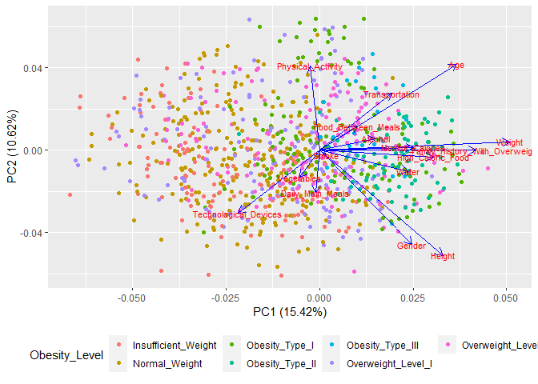<!-- -->

The vectors begin at the origin and extend to coordinates given by the
loading vector. The more parallel to a principal component axis, the
more it contributes to only that PC. The longer the vector, the more
variability of this variable is being represented by the two displayed
principal components. The angles between vectors of different variables
show their correlation in this space. Small angles represent high
positive correlation. Right angles represent the lack of correlation.
Opposite angles represent high negative correlation.

## Modeling Technique 2

An exploratory factor analysis of the obesity data was carried out using
a polychoric correlation matrix. Parallel analysis was used to determine
the number of factors.

Instead of using a Pearson correlation matrix, a polychoric correlation
matrix was used because of the ordinal encoded variables. The polychoric
correlation coefficient measures association for ordinal variables.
Identification of the underlying relationships between the measured
variables was expected after the analysis.

### Results

The computed Pearson and polychoric correlation matrices are visualized
below. Positive values are shaded in blue, while negative values are
shaded in red. The greater the absolute value of the correlation, the
deeper the color.

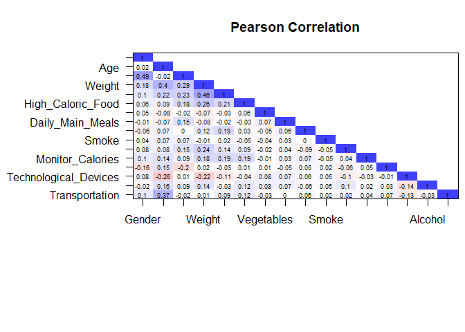<!-- -->

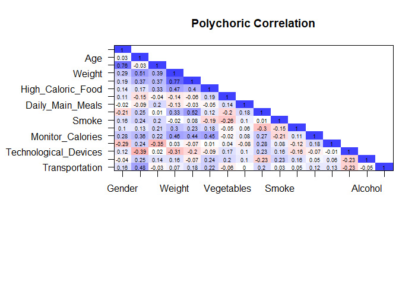<!-- -->

The correlation matrices above have very similar patterns, but the
polychoric correlation matrix suggests a stronger association.

A parallel analysis was used to determine the number of factors.
Parallel analysis is one method to help determine how many factors to
retain and is visualized using a scree plot. A scree plot is shown
below:

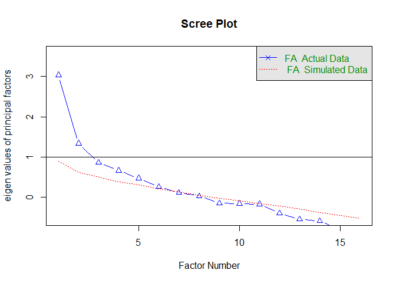<!-- -->

Since parallel analysis is a simulation technique, it may give different
results each time. It is necessary to re-run it a few times to get a
stable recommendation. The blue line shows the observed eigen values.
The red dotted line shows the simulated data line. Each point on the
blue line that lies above the red line is a factor to extract. From the
scree plot above, parallel analysis suggested that the number of factors
to retain was six. So, a factor analysis with six latent factors is
performed, with maximum likelihood estimation. 62.8% of variance is
explained cumulatively.

**Unrotated**

The first factor F1 accounts for 12.6% of total variance. The variables
“Age” and “Food_Between_Meals” have high positive loadings on this
factor. “Vegetables” has high negative loadings on this factor. “Gender”
and “Water” also load negatively on this factor. F3 accounts for 12.2%
of total variance. It is primarily defined by “Monitor_Calories”.
“Smoke” loads negatively on this factor. F2 accounts for 10.8% of total
variance. The variables “Gender”, “Smoke”, and “Height” have high
positive loadings on this factor. “Food_Between_Meals” and
“Physical_Activity” load negatively on this factor. F5 accounts for 9.2%
of total variance. It is primarily defined by “Technological_Devices”.
“Age”, “Weight”, “Water”, “Monitor_Calories”, and “Transportation” load
negatively on this factor. F6 accounts for 9.1% of total variance.
“Family_History_With_Overweight” and “Weight” have high positive
loadings on this factor. “Physical_Activity”, “Technological_Devices”,
and “Transportation” load negatively on this factor. F4 accounts for
9.0% of total variance. “Age”, “Vegetables”, “Smoke”,
“Physical_Activity”, and “Alcohol” load negatively on this factor.

The interpretation of the six factors is visually displayed below, with
all loadings with an absolute value greater than 0.3 being represented
as an edge.

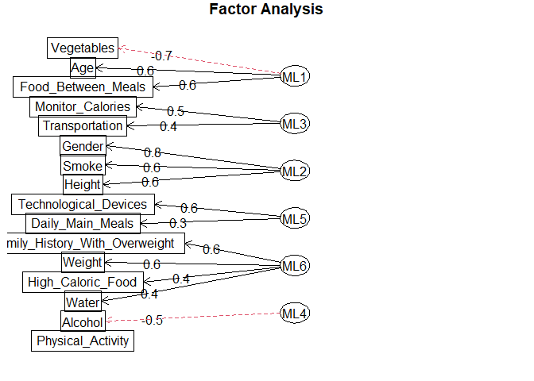<!-- -->

<!-- -->

**Orthogonal Rotation**

After a varimax rotation is performed on the data, the rotated factor
loadings are calculated. 62.8% of variance is explained cumulatively for
orthogonally rotated loadings. “Weight” and
“Family_History_With_Overweight” have large positive loadings on F6.
“Gender” and “Height” have large positive loadings on F2.
“Food_Between_Meals” and “Technological_Devices” have large positive
loadings on F5. “Age” has large positive loadings on F3. “Vegetables”
has large positive loadings on F1. “Smoke” has large positive loadings
on F4. The fact that there are no direct linkages between the factors
shows that they are independent of each other.

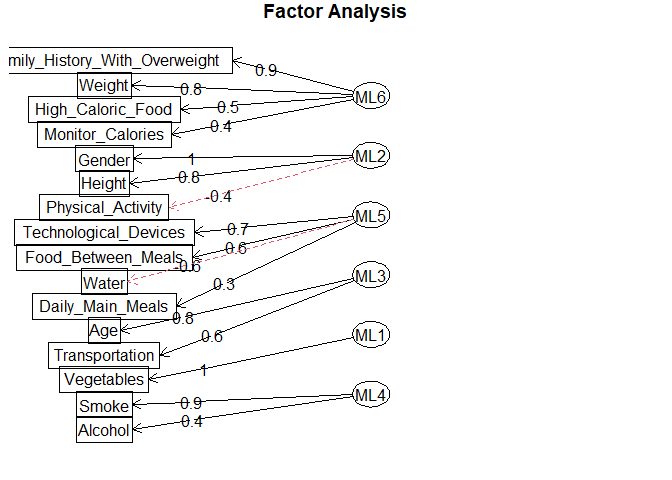<!-- -->

<!-- -->

**Oblique Rotation**

After a promax rotation is performed on the data, the rotated factor
loadings are calculated. 63.6% of variance is explained cumulatively for
oblique rotated loadings. “Weight” and “Family_History_With_Overweight”
have large positive loadings on F6. “Gender” and “Height” have large
positive loadings on F2. “Food_Between_Meals” and
“Technological_Devices” have large positive loadings on F5. “Age” has
large positive loadings on F3. “Smoke” has large positive loadings on
F4. “Vegetables” has large positive loadings on F1. The direct linkage
between F6 and F3 shows that they are dependent of each other.

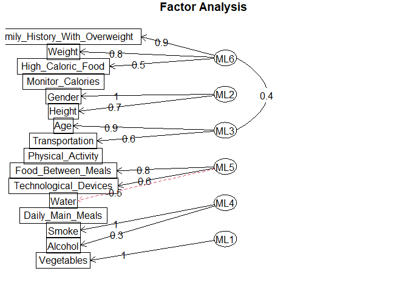<!-- -->

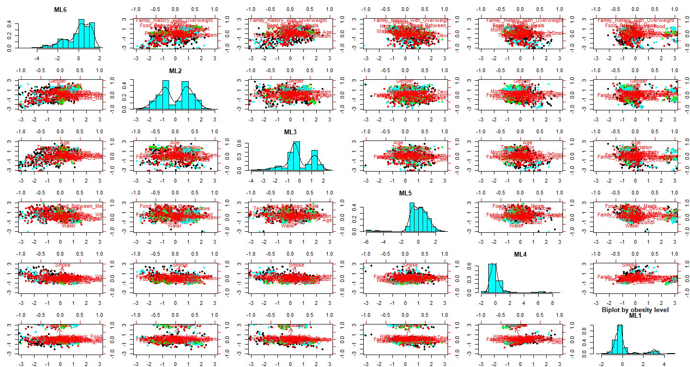<!-- -->

# Discussion

The principal components describe variation and account for the varied
influences of the original characteristics. Looking at the PCA biplot
using the correlation matrix, “Family_History_With_Overweight”,
“Monitor_Calories”, “Weight”, and “High_Caloric_Food” are the most
important contributors to the first PC, while “Daily_Main_Meals” and
“Physical_Activity” strongly influence PC2. “Monitor_Calories” and
“Weight” are highly correlated. “Technological_Devices” and
“Physical_Activity” are uncorrelated with most of the other variables.

“Gender”, “Age”, “Weight”, “Family_History_With_Overweight”,
“High_Caloric_Food”, “Daily_Main_Meals”, “Monitor_Calories”, and
“Technological_Devices” are highly significantly associated to changes
in Obesity_Level, while changes in “Vegetables”, “Food_Between_Meals”,
“Smoke”, “Water”, “Physical_Activity”, and “Transportation” are not
significantly associated with Obesity_Level.

The exploratory factor analysis biplots indicate that the latent factors
are not normally distributed. It is necessary to further explore the
structure of the data by using a nonlinear factor analysis approach.

Analysis can be improved by encoding the original data set in a
different way, for example: one hot encoding, dummy encoding, effect or
deviation encoding, hash encoding, binary encoding, base N encoding, and
target encoding. A nonlinear factor analysis may help to explore the
structure of the data. After my classmates’ presentations, doing
different transformations on the data would be considered for further
studies.

# Sources

1.  Centers for Disease Control and Prevention. (2021, April 7). About
    overweight and obesity. Centers for Disease Control and Prevention.
    Retrieved December 2021, from
    [https://www.cdc.gov/obesity/about-obesity/index.html.](https://www.cdc.gov/obesity/about-obesity/index.html)
2.  South America. Global Nutrition Report \| Country Nutrition
    Profiles - Global Nutrition Report. (n.d.). Retrieved December 2021,
    from
    [https://globalnutritionreport.org/resources/nutrition-profiles/latin-america-and-caribbean/south-america/.](https://globalnutritionreport.org/resources/nutrition-profiles/latin-america-and-caribbean/south-america/)
3.  Popkin, B. M., & Reardon, T. (2018). Obesity and the food system
    transformation in Latin America. Obesity reviews : an official
    journal of the International Association for the Study of Obesity,
    19(8), 1028–1064.
    [https://doi.org/10.1111/obr.12694.](https://doi.org/10.1111/obr.12694)
4.  University of California, Irvine, Machine Learning Repository.
    [https://archive.ics.uci.edu/ml/datasets/Estimation+of+obesity+levels+based+on+eating+habits+and+physical+condition+.](https://archive.ics.uci.edu/ml/datasets/Estimation+of+obesity+levels+based+on+eating+h%20abits+and+physical+condition+)
5.  Mendoza Palechor, F., & de la Hoz Manotas, A. (2019). Dataset for
    estimation of obesity levels based on eating habits and physical
    condition in individuals from Colombia, Peru, and Mexico. Data in
    Brief, 25,
    [https://doi.org/10.1016/j.dib.2019.104344.](https://doi.org/10.1016/j.dib.2019.104344)
6.  MIT. (n.d.). CHANGES IN YOUNG ADULTHOOD. Young Adult Development
    Project. Retrieved December 2021, from
    [https://hr.mit.edu/static/worklife/youngadult/changes.html.](https://hr.mit.edu/static/worklife/youngadult/changes.html)
7.  Brownlee, J. (2020, August 17). Ordinal and one-hot encodings for
    Categorical Data. Machine Learning Mastery. Retrieved December 2021,
    from
    [https://machinelearningmastery.com/one-hot-encoding-for-categorical-data/.](https://machinelearningmastery.com/one-hot-encoding-for-categorical-data/)
8.  Hartmann, K., Krois, J., & Waske, B. (2017, May 1). Interpretation
    and visualization. Interpretation and Visualization • SOGA •.
    Retrieved December 2021, from
    <https://www.geo.fu-berlin.de/en/v/soga/Geodata-analysis/Principal-Component-Analysis/principal-components-basics/Interpretation-and-visualization/index.html>
